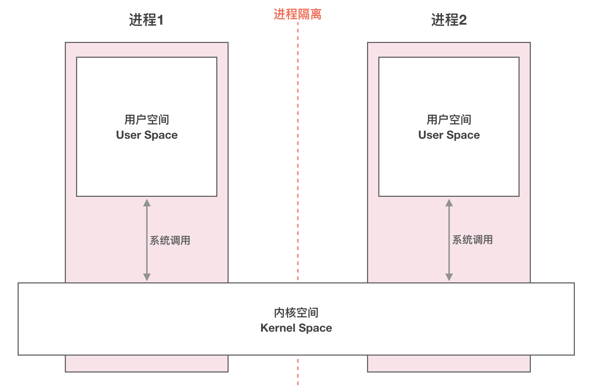
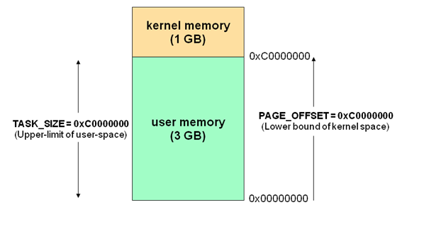
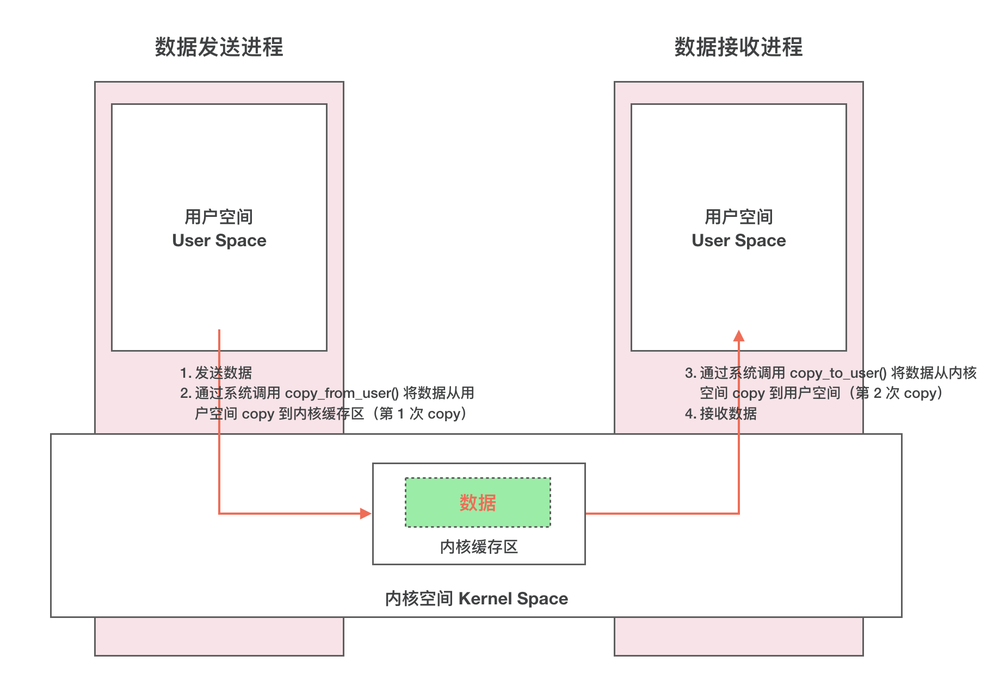
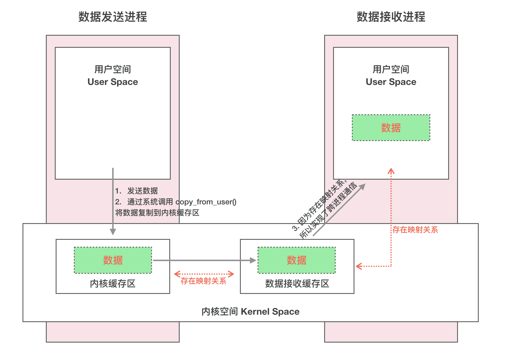
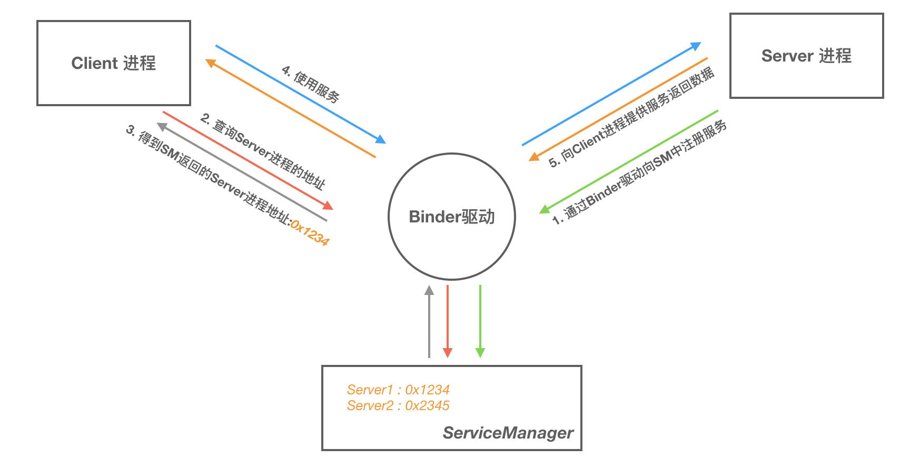
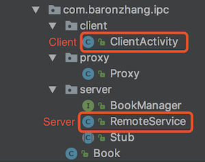

# 写给 Android 应用工程师的 Binder 原理剖析


## 一. 前言

这篇文章我酝酿了很久，参考了很多资料，读了很多源码，却依旧不敢下笔。生怕自己理解上还有偏差，对大家造成误解，贻笑大方。又怕自己理解不够透彻，无法用清晰直白的文字准确的表达出 Binder 的设计精髓。直到今天提笔写作时还依旧战战兢兢。

Binder 之复杂远远不是一篇文章就能说清楚的，本文想站在一个更高的维度来俯瞰 Binder 的设计，最终帮助大家形成一个完整的概念。对于应用层开发的同学来说，理解到本文这个程度也就差不多了。希望更加深入理解 Binder 实现机制的，可以阅读文末的参考资料以及相关源码。

## 二. Binder 概述

简单介绍下什么是 Binder。Binder 是一种进程间通信机制，基于开源的 OpenBinder 实现；OpenBinder 起初由 Be Inc. 开发，后由 Plam Inc. 接手。从字面上来解释 Binder 有胶水、粘合剂的意思，顾名思义就是粘和不同的进程，使之实现通信。对于 Binder 更全面的定义，等我们介绍完 Binder 通信原理后再做详细说明。

### 2.1 为什么必须理解 Binder ？

作为 Android 工程师的你，是不是常常会有这样的疑问：

* 为什么 Activity 间传递对象需要序列化？
* Activity 的启动流程是什么样的？
* 四大组件底层的通信机制是怎样的？
* AIDL 内部的实现原理是什么？
* 插件化编程技术应该从何学起？等等...

这些问题的背后都与 Binder 有莫大的关系，要弄懂上面这些问题理解 Bidner 通信机制是必须的。

我们知道 Android 应用程序是由 Activity、Service、Broadcast Receiver 和 Content Provide 四大组件中的一个或者多个组成的。有时这些组件运行在同一进程，有时运行在不同的进程。这些进程间的通信就依赖于 Binder IPC 机制。不仅如此，Android 系统对应用层提供的各种服务如：ActivityManagerService、PackageManagerService 等都是基于 Binder IPC 机制来实现的。Binder 机制在 Android 中的位置非常重要，毫不夸张的说理解 Binder 是迈向 Android 高级工程的第一步。

### 2.2 为什么是 Binder ?

Android 系统是基于 Linux 内核的，Linux 已经提供了管道、消息队列、共享内存和 Socket 等 IPC 机制。那为什么 Android 还要提供 Binder 来实现 IPC 呢？主要是基于**性能**、**稳定性**和**安全性**几方面的原因。

#### 性能

首先说说性能上的优势。Socket 作为一款通用接口，其传输效率低，开销大，主要用在跨网络的进程间通信和本机上进程间的低速通信。消息队列和管道采用存储-转发方式，即数据先从发送方缓存区拷贝到内核开辟的缓存区中，然后再从内核缓存区拷贝到接收方缓存区，至少有两次拷贝过程。共享内存虽然无需拷贝，但控制复杂，难以使用。Binder 只需要一次数据拷贝，性能上仅次于共享内存。

注：各种IPC方式数据拷贝次数，此表来源于[Android Binder 设计与实现 - 设计篇](http://blog.csdn.net/universus/article/details/6211589)

| IPC方式 | 数据拷贝次数 |
|:---|:---|
|共享内存|0|
|Binder|1|
|Socket/管道/消息队列|2|

#### 稳定性

再说说稳定性，Binder 基于 C/S 架构，客户端（Client）有什么需求就丢给服务端（Server）去完成，架构清晰、职责明确又相互独立，自然稳定性更好。共享内存虽然无需拷贝，但是控制负责，难以使用。从稳定性的角度讲，Binder 机制是优于内存共享的。

#### 安全性

另一方面就是安全性。Android 作为一个开放性的平台，市场上有各类海量的应用供用户选择安装，因此安全性对于 Android 平台而言极其重要。作为用户当然不希望我们下载的 APP 偷偷读取我的通信录，上传我的隐私数据，后台偷跑流量、消耗手机电量。传统的 IPC 没有任何安全措施，完全依赖上层协议来确保。首先传统的 IPC 接收方无法获得对方可靠的进程用户ID/进程ID（UID/PID），从而无法鉴别对方身份。Android 为每个安装好的 APP 分配了自己的 UID，故而进程的 UID 是鉴别进程身份的重要标志。传统的 IPC 只能由用户在数据包中填入 UID/PID，但这样不可靠，容易被恶意程序利用。可靠的身份标识只有由 IPC 机制在内核中添加。其次传统的 IPC 访问接入点是开放的，只要知道这些接入点的程序都可以和对端建立连接，不管怎样都无法阻止恶意程序通过猜测接收方地址获得连接。同时 Binder 既支持实名 Binder，又支持匿名 Binder，安全性高。

基于上述原因，Android 需要建立一套新的 IPC 机制来满足系统对稳定性、传输性能和安全性方面的要求，这就是 Binder。


**最后用一张表格来总结下 Binder 的优势：**

| 优势 | 描述 |
|:---|:---|
|性能|只需要一次数据拷贝，性能上仅次于共享内存|
|稳定性|基于 C/S 架构，职责明确、架构清晰，因此稳定性好|
|安全性|为每个 APP 分配 UID，进程的 UID 是鉴别进程身份的重要标志|

## 三. Linux 下传统的进程间通信原理

了解 Linux IPC 相关的概念和原理有助于我们理解 Binder 通信原理。因此，在介绍 Binder 跨进程通信原理之前，我们先聊聊 Linux 系统下传统的进程间通信是如何实现。

### 3.1 基本概念介绍

这里我们先从 Linux 中进程间通信涉及的一些基本概念开始介绍，然后逐步展开，向大家说明传统的进程间通信的原理。



上图展示了 Liunx 中跨进程通信涉及到的一些基本概念：

* 进程隔离
* 进程空间划分：用户空间(User Space)/内核空间(Kernel Space)
* 系统调用：用户态/内核态

#### 进程隔离

简单的说就是操作系统中，进程与进程间内存是不共享的。两个进程就像两个平行的世界，A 进程没法直接访问 B 进程的数据，这就是进程隔离的通俗解释。A 进程和 B 进程之间要进行数据交互就得采用特殊的通信机制：进程间通信（IPC）。

#### 进程空间划分：用户空间(User Space)/内核空间(Kernel Space)

现在操作系统都是采用的虚拟存储器，对于 32 位系统而言，它的寻址空间（虚拟存储空间）就是 2 的 32 次方，也就是 4GB。操作系统的核心是内核，独立于普通的应用程序，可以访问受保护的内存空间，也可以访问底层硬件设备的权限。为了保护用户进程不能直接操作内核，保证内核的安全，操作系统从逻辑上将虚拟空间划分为用户空间（User Space）和内核空间（Kernel Space）。针对 Linux 操作系统而言，将最高的 1GB 字节供内核使用，称为内核空间；较低的 3GB 字节供各进程使用，称为用户空间。

> 简单的说就是，内核空间（Kernel）是系统内核运行的空间，用户空间（User Space）是用户程序运行的空间。为了保证安全性，它们之间是隔离的。



#### 系统调用：用户态与内核态

虽然从逻辑上进行了用户空间和内核空间的划分，但不可避免的用户空间需要访问内核资源，比如文件操作、访问网络等等。为了突破隔离限制，就需要借助**系统调用**来实现。系统调用是用户空间访问内核空间的唯一方式，保证了所有的资源访问都是在内核的控制下进行的，避免了用户程序对系统资源的越权访问，提升了系统安全性和稳定性。

Linux 使用两级保护机制：0 级供系统内核使用，3 级供用户程序使用。

当一个任务（进程）执行系统调用而陷入内核代码中执行时，称进程处于**内核运行态（内核态）**。此时处理器处于特权级最高的（0级）内核代码中执行。当进程处于内核态时，执行的内核代码会使用当前进程的内核栈。每个进程都有自己的内核栈。

当进程在执行用户自己的代码的时候，我们称其处于**用户运行态（用户态）**。此时处理器在特权级最低的（3级）用户代码中运行。

系统调用主要通过如下两个函数来实现：

```
copy_from_user() //将数据从用户空间拷贝到内核空间
copy_to_user() //将数据从内核空间拷贝到用户空间
```

### 3.2 Linux 下的传统 IPC 通信原理

理解了上面的几个概念，我们再来看看传统的 IPC 方式中，进程之间是如何实现通信的。

通常的做法是消息发送方将要发送的数据存放在内存缓存区中，通过系统调用进入内核态。然后内核程序在内核空间分配内存，开辟一块内核缓存区，调用 copy_from_user() 函数将数据从用户空间的内存缓存区拷贝到内核空间的内核缓存区中。同样的，接收方进程在接收数据时在自己的用户空间开辟一块内存缓存区，然后内核程序调用 copy_to_user() 函数将数据从内核缓存区拷贝到接收进程的内存缓存区。这样数据发送方进程和数据接收方进程就完成了一次数据传输，我们称完成了一次进程间通信。如下图：



这种传统的 IPC 通信方式有两个问题：

1. 性能低下，一次数据传递需要经历：内存缓存区 --> 内核缓存区 --> 内存缓存区，需要 2 次数据拷贝；
2. 接收数据的缓存区由数据接收进程提供，但是接收进程并不知道需要多大的空间来存放将要传递过来的数据，因此只能开辟尽可能大的内存空间或者先调用 API 接收消息头来获取消息体的大小，这两种做法不是浪费空间就是浪费时间。

## 四. Binder 跨进程通信原理

理解了 Linux IPC 相关概念和通信原理，接下来我们正式介绍下 Binder IPC 的原理。

### 4.1 动态内核可加载模块 && 内存映射

正如前面所说，跨进程通信是需要内核空间做支持的。传统的 IPC 机制如管道、Socket 都是内核的一部分，因此通过内核支持来实现进程间通信自然是没问题的。但是 Binder 并不是 Linux 系统内核的一部分，那怎么办呢？这就得益于 Linux 的**动态内核可加载模块**（Loadable Kernel Module，LKM）的机制；模块是具有独立功能的程序，它可以被单独编译，但是不能独立运行。它在运行时被链接到内核作为内核的一部分运行。这样，Android 系统就可以通过动态添加一个内核模块运行在内核空间，用户进程之间通过这个内核模块作为桥梁来实现通信。

> 在 Android 系统中，这个运行在内核空间，负责各个用户进程通过 Binder 实现通信的内核模块就叫 **Binder 驱动**（Binder Dirver）。

那么在 Android 系统中用户进程之间是如何通过这个内核模块（Binder 驱动）来实现通信的呢？难道是和前面说的传统 IPC 机制一样，先将数据从发送方进程拷贝到内核缓存区，然后再将数据从内核缓存区拷贝到接收方进程，通过两次拷贝来实现吗？显然不是，否则也不会有开篇所说的 Binder 在性能方面的优势了。

这就不得不通道 Linux 下的另一个概念：**内存映射**。

Binder IPC 机制中涉及到的内存映射通过 mmap() 来实现，mmap() 是操作系统中一种内存映射的方法。内存映射简单的讲就是将用户空间的一块内存区域映射到内核空间。映射关系建立后，用户对这块内存区域的修改可以直接反应到内核空间；反之内核空间对这段区域的修改也能直接反应到用户空间。

内存映射能减少数据拷贝次数，实现用户空间和内核空间的高效互动。两个空间各自的修改能直接反映在映射的内存区域，从而被对方空间及时感知。也正因为如此，内存映射能够提供对进程间通信的支持。

### 4.2 Binder IPC 实现原理

Binder IPC 正是基于内存映射（mmap）来实现的，但是 mmap() 通常是用在有物理介质的文件系统上的。

比如进程中的用户区域是不能直接和物理设备打交道的，如果想要把磁盘上的数据读取到进程的用户区域，需要两次拷贝（磁盘-->内核空间-->用户空间）；通常在这种场景下 mmap() 就能发挥作用，通过在物理介质和用户空间之间建立映射，减少数据的拷贝次数，用内存读写取代I/O读写，提高文件读取效率。

而 Binder 并不存在物理介质，因此 Binder 驱动使用 mmap() 并不是为了在物理介质和用户空间之间建立映射，而是用来在内核空间创建数据接收的缓存空间。

一次完整的 Binder IPC 通信过程通常是这样：

1. 首先 Binder 驱动在内核空间创建一个数据接收缓存区；
2. 接着在内核空间开辟一块内核缓存区，建立**内核缓存区**和**内核中数据接收缓存区**之间的映射关系，以及**内核中数据接收缓存区**和**接收进程用户空间地址**的映射关系；
3. 发送方进程通过系统调用 copy_from_user() 将数据 copy 到内核中的**内核缓存区**，由于内核缓存区和接收进程的用户空间存在内存映射，因此也就相当于把数据发送到了接收进程的用户空间，这样便完成了一次进程间的通信。

如下图：



## 五. Binder 通信模型

介绍完 Binder IPC 的底层通信原理，接下来我们看看实现层面是如何设计的。

一次完整的进程间通信必然至少包含两个进程，通常我们称通信的双方分别为客户端进程（Client）和服务端进程（Server），由于进程隔离机制的存在，通信双方必然需要借助 Binder 来实现。

### 5.1 Client/Server/ServiceManager/驱动

前面我们介绍过，Binder 是基于 C/S 架构的。由一系列的组件组成，包括 Client、Server、ServiceManager、Binder 驱动。其中 Client、Server、Service Manager 运行在用户空间，Binder 驱动运行在内核空间。其中 Service Manager 和 Binder 驱动由系统提供，而 Client、Server 由应用程序来实现。Client、Server 和 ServiceManager 均是通过系统调用 open、mmap 和 ioctl 来访问设备文件 /dev/binder，从而实现与 Binder 驱动的交互来间接的实现跨进程通信。


Client、Server、ServiceManager、Binder 驱动这几个组件在通信过程中扮演的角色就如同互联网中服务器（Server）、客户端（Client）、DNS域名服务器（ServiceManager）以及路由器（Binder 驱动）之前的关系。

通常我们访问一个网页的步骤是这样的：首先在浏览器输入一个地址，如 www.google.com 然后按下回车键。但是并没有办法通过域名地址直接找到我们要访问的服务器，因此需要首先访问 DNS 域名服务器，域名服务器中保存了 www.google.com 对应的 ip 地址 10.249.23.13，然后通过这个 ip 地址才能放到到 www.google.com 对应的服务器。


*[Android Binder 设计与实现](http://blog.csdn.net/universus/article/details/6211589)一文中对 Client、Server、ServiceManager、Binder 驱动有很详细的描述，以下是部分摘录：*

>**Binder 驱动**<br>
> Binder 驱动就如同路由器一样，是整个通信的核心；驱动负责进程之间 Binder 通信的建立，Binder 在进程之间的传递，Binder 引用计数管理，数据包在进程之间的传递和交互等一系列底层支持。 <br>
> **ServiceManager 与实名 Binder**<br>
> ServiceManager 和 DNS 类似，作用是将字符形式的 Binder 名字转化成 Client 中对该 Binder 的引用，使得 Client 能够通过 Binder 的名字获得对 Binder 实体的引用。注册了名字的 Binder 叫实名 Binder，就像网站一样除了除了有 IP 地址意外还有自己的网址。Server 创建了 Binder，并为它起一个字符形式，可读易记得名字，将这个 Binder 实体连同名字一起以数据包的形式通过 Binder 驱动发送给 ServiceManager ，通知 ServiceManager 注册一个名为“张三”的 Binder，它位于某个 Server 中。驱动为这个穿越进程边界的 Binder 创建位于内核中的实体节点以及 ServiceManager 对实体的引用，将名字以及新建的引用打包传给 ServiceManager。ServiceManger 收到数据后从中取出名字和引用填入查找表。<br><br>
> 细心的读者可能会发现，ServierManager 是一个进程，Server 是另一个进程，Server 向 ServiceManager 中注册 Binder 必然涉及到进程间通信。当前实现进程间通信又要用到进程间通信，这就好像蛋可以孵出鸡的前提却是要先找只鸡下蛋！Binder 的实现比较巧妙，就是预先创造一只鸡来下蛋。ServiceManager 和其他进程同样采用 Bidner 通信，ServiceManager 是 Server 端，有自己的 Binder 实体，其他进程都是 Client，需要通过这个 Binder 的引用来实现 Binder 的注册，查询和获取。ServiceManager 提供的 Binder 比较特殊，它没有名字也不需要注册。当一个进程使用 BINDER_SET_CONTEXT_MGR 命令将自己注册成 ServiceManager 时 Binder 驱动会自动为它创建 Binder 实体（**这就是那只预先造好的那只鸡**）。其次这个 Binder 实体的引用在所有 Client 中都固定为 0 而无需通过其它手段获得。也就是说，一个 Server 想要向 ServiceManager 注册自己的 Binder 就必须通过这个 0 号引用和 ServiceManager 的 Binder 通信。类比互联网，0 号引用就好比是域名服务器的地址，你必须预先动态或者手工配置好。要注意的是，这里说的 Client 是相对于 ServiceManager 而言的，一个进程或者应用程序可能是提供服务的 Server，但对于 ServiceManager 来说它仍然是个 Client。<br><br>
> **Client 获得实名 Binder 的引用**<br>
> Server 向 ServiceManager 中注册了 Binder 以后， Client 就能通过名字获得 Binder 的引用了。Client 也利用保留的 0 号引用向 ServiceManager 请求访问某个 Binder: 我申请访问名字叫张三的 Binder 引用。ServiceManager 收到这个请求后从请求数据包中取出 Binder 名称，在查找表里找到对应的条目，取出对应的 Binder 引用作为回复发送给发起请求的 Client。从面向对象的角度看，Server 中的 Binder 实体现在有两个引用：一个位于 ServiceManager 中，一个位于发起请求的 Client 中。如果接下来有更多的 Client 请求该 Binder，系统中就会有更多的引用指向该 Binder ，就像 Java 中一个对象有多个引用一样。

### 5.2 Binder 通信过程

至此，我们大致能总结出 Binder 通信过程：

1. 首先，一个进程使用 BINDER_SET_CONTEXT_MGR 命令通过 Binder 驱动将自己注册成为 ServiceManager；
2. Server 通过驱动向 ServiceManager 中注册 Binder（Server 中的 Binder 实体），表明可以对外提供服务。驱动为这个 Binder 创建位于内核中的实体节点以及 ServiceManager 对实体的引用，将名字以及新建的引用打包传给 ServiceManager，ServiceManger 将其填入查找表。
3. Client 通过名字，在 Binder 驱动的帮助下从 ServiceManager 中获取到对 Binder 实体的引用，通过这个引用就能实现和 Server 进程的通信。

我们看到整个通信过程都需要 Binder 驱动的接入。下图能更加直观的展现整个通信过程(为了进一步抽象通信过程以及呈现上的方便，下图我们忽略了 Binder 实体及其引用的概念)：



### 5.3 Binder 通信中的代理模式

我们已经解释清楚 Client、Server 借助 Binder 驱动完成跨进程通信的实现机制了，但是还有个问题会让我们困惑。A 进程想要 B 进程中某个对象（object）是如何实现的呢？毕竟它们分属不同的进程，A 进程 没法直接使用 B 进程中的 object。

前面我们介绍过跨进程通信的过程都有 Binder 驱动的参与，因此在数据流经 Binder 驱动的时候驱动会对数据做一层转换。当 A 进程想要获取 B 进程中的 object 时，驱动并不会真的把 object 返回给 A，而是返回了一个跟 object 看起来一模一样的代理对象 objectProxy，这个 objectProxy 具有和 object 一摸一样的方法，但是这些方法并没有 B 进程中 object 对象那些方法的能力，这些方法只需要把把请求参数交给驱动即可。对于 A 进程来说和直接调用 object 中的方法是一样的。

当 Binder 驱动接收到 A 进程的消息后，发现这是个 objectProxy 就去查询自己维护的表单，一查发现这是 B 进程 object 的代理对象。于是就会去通知 B 进程调用 object 的方法，并要求 B 进程把返回结果发给自己。当驱动拿到 B 进程的返回结果后就会转发给 A 进程，一次通信就完成了。


### 5.4 Binder 的完整定义

现在我们可以对 Binder 做个更加全面的定义了：

* 从进程间通信的角度看，Binder 是一种进程间通信的机制；
* 从 Server 进程的角度看，Binder 指的是 Server 中的 Binder 实体对象；
* 从 Client 进程的角度看，Binder 指的是对 Binder 代理对象，是 Binder 实体对象的一个远程代理
* 从传输过程的角度看，Binder 是一个可以跨进程传输的对象；Binder 驱动会对这个跨越进程边界的对象对一点点特殊处理，自动完成代理对象和本地对象之间的转换。

## 六. 手动编码实现跨进程调用

通常我们在做开发时，实现进程间通信用的最多的就是 AIDL。当我们定义好 AIDL 文件，在编译时编译器会帮我们生成代码实现 IPC 通信。借助 AIDL 编译以后的代码能帮助我们进一步理解 Binder IPC 的通信原理。

但是无论是从可读性还是可理解性上来看，编译器生成的代码对开发者并不友好。比如一个 BookManager.aidl 文件对应会生成一个 BookManager.java 文件，这个 java 文件包含了一个 BookManager 接口、一个 Stub 静态的抽象类和一个 Proxy 静态类。Proxy 是 Stub 的静态内部类，Stub 又是 BookManager 的静态内部类，这就造成了可读性和可理解性的问题。

> Android 之所以这样设计其实是有道理的，因为当有多个 AIDL 文件的时候把 BookManager、Stub、Proxy 放在同一个文件里能有效避免 Stub 和 Proxy 重名的问题。

因此便于大家理解，下面我们来手动编写代码来实现跨进程调用。

### 6.1 各 Java 类职责描述

在正式编码实现跨进程调用之前，先介绍下实现过程中用到的一些类。了解了这些类的职责，有助于我们更好的理解和实现跨进程通信。

* **IBinder** : IBinder 是一个接口，代表了一种跨进程通信的能力。只要实现了这个借口，这个对象就能跨进程传输。

* **IInterface** :  IInterface 代表的就是 Server 进程对象具备什么样的能力（能提供哪些方法，其实对应的就是 AIDL 文件中定义的接口）

* **Binder** : Java 层的 Binder 类，代表的其实就是 Binder 本地对象。BinderProxy 类是 Binder 类的一个内部类，它代表远程进程的 Binder 对象的本地代理；这两个类都继承自 IBinder, 因而都具有跨进程传输的能力；实际上，在跨越进程的时候，Binder 驱动会自动完成这两个对象的转换。

* **Stub** : AIDL 的时候，编译工具会给我们生成一个名为 Stub 的静态内部类；这个类继承了 Binder, 说明它是一个 Binder 本地对象，它实现了 IInterface 接口，表明它具有 Server 承诺给 Client 的能力；Stub 是一个抽象类，具体的 IInterface 的相关实现需要开发者自己实现。

### 6.2 实现过程讲解

一次跨进程通信必然会涉及到两个进程，在这个例子中 RemoteService 作为服务端进程，提供服务；ClientActivity 作为客户端进程，使用 RemoteService 提供的服务。如下图：



那么服务端进程具备什么样的能力？能为客户端提供什么样的服务呢？还记得我们前面介绍过的 IInterface 吗，它代表的就是服务端进程具体什么样的能力。因此我们需要定义一个 BookManager 接口，BookManager 继承自 IIterface，表明服务端具备什么样的能力。

```java
/**
 * 这个类用来定义服务端 RemoteService 具备什么样的能力
 */
public interface BookManager extends IInterface {

    void addBook(Book book) throws RemoteException;
}
```

只定义服务端具备什么样的能力是不够的，既然是跨进程调用，那么接下来我们得实现一个跨进程调用对象 Stub。Stub 继承 Binder, 说明它是一个 Binder 本地对象；实现 IInterface 接口，表明具有 Server 承诺给 Client 的能力；Stub 是一个抽象类，具体的 IInterface 的相关实现需要调用方自己实现。

```Java
public abstract class Stub extends Binder implements BookManager {

    ...
    
    public static BookManager asInterface(IBinder binder) {
        if (binder == null)
            return null;
        IInterface iin = binder.queryLocalInterface(DESCRIPTOR);
        if (iin != null && iin instanceof BookManager)
            return (BookManager) iin;
        return new Proxy(binder);
    }

    ...

    @Override
    protected boolean onTransact(int code, Parcel data, Parcel reply, int flags) throws RemoteException {
        switch (code) {

            case INTERFACE_TRANSACTION:
                reply.writeString(DESCRIPTOR);
                return true;

            case TRANSAVTION_addBook:
                data.enforceInterface(DESCRIPTOR);
                Book arg0 = null;
                if (data.readInt() != 0) {
                    arg0 = Book.CREATOR.createFromParcel(data);
                }
                this.addBook(arg0);
                reply.writeNoException();
                return true;

        }
        return super.onTransact(code, data, reply, flags);
    }

    ...
}
```

Stub 类中我们重点介绍下 `asInterface` 和 `onTransact`。

先说说 `asInterface`，当 Client 端在创建和服务端的连接，调用 bindService 时需要创建一个 ServiceConnection 对象作为入参。在 ServiceConnection 的回调方法 onServiceConnected 中 会通过这个 asInterface(IBinder binder) 拿到 BookManager 对象，这个 IBinder 类型的入参 binder 是驱动传给我们的，正如你在代码中看到的一样，方法中会去调用 binder.queryLocalInterface() 去查找 Binder 本地对象，如果找到了就说明 Client 和 Server 在同一进程，那么这个 binder 本身就是 Binder 本地对象，可以直接使用。否则说明是 binder 是个远程对象，也就是 BinderProxy。因此需要我们创建一个代理对象 Proxy，通过这个代理对象来是实现远程访问。

接下来我们就要实现这个代理类 Proxy 了，既然是代理类自然需要实现 BookManager 接口。

```java
public class Proxy implements BookManager {
    
    ...

    public Proxy(IBinder remote) {
        this.remote = remote;
    }

    @Override
    public void addBook(Book book) throws RemoteException {

        Parcel data = Parcel.obtain();
        Parcel replay = Parcel.obtain();
        try {
            data.writeInterfaceToken(DESCRIPTOR);
            if (book != null) {
                data.writeInt(1);
                book.writeToParcel(data, 0);
            } else {
                data.writeInt(0);
            }
            remote.transact(Stub.TRANSAVTION_addBook, data, replay, 0);
            replay.readException();
        } finally {
            replay.recycle();
            data.recycle();
        }
    }

    ...
}
```

我们看看 addBook() 的实现；在 Stub 类中，addBook(Book book) 是一个抽象方法，Server 端需要去实现它。

* 如果 Client 和 Server 在同一个进程，那么直接就是调用这个方法。
* 如果是远程调用，Client 想要调用 Server 的方法就需要通过 Binder 代理来完成，也就是上面的 Proxy。

在 Proxy 中的 addBook() 方法中首先通过 Parcel 将数据序列化，然后调用 remote.transact()。正如前文所述 Proxy 是在 Stub 的 asInterface 中创建，能走到创建 Proxy 这一步就说明 Proxy 构造函数的入参是 BinderProxy，即这里的 remote 是个 BinderProxy 对象。最终通过一系列的函数调用，Client 进程通过系统调用陷入内核态，Client 进程中执行 addBook() 的线程挂起等待返回；驱动完成一系列的操作之后唤醒 Server 进程，调用 Server 进程本地对象的 onTransact()。最终又走到了 Stub 中的 onTransact() 中，onTransact() 根据函数编号调用相关函数（在 Stub 类中为 BookManager 接口中的每个函数中定义了一个编号，只不过上面的源码中我们简化掉了；在跨进程调用的时候，不会传递函数而是传递编号来指明要调用哪个函数）；我们这个例子里面，调用了 Binder 本地对象的 addBook() 并将结果返回给驱动，驱动唤醒 Client 进程里刚刚挂起的线程并将结果返回。

这样一次跨进程调用就完成了。

完整的代码我放到 GitHub 上了，有兴趣的小伙伴可以去看看。源码地址：[https://github.com/BaronZ88/HelloBinder](https://github.com/BaronZ88/HelloBinder)

最后建议大家在不借助 AIDL 的情况下手写实现 Client 和 Server 进程的通信，加深对 Binder 通信过程的理解。

> 受个人能力水平限制，文章中难免会有错误。如果大家发现文章不足之处，欢迎与我沟通交流。

**本文在写作过程中参考了很多文章、书籍和源码，其中有很多描述和图片都借鉴了下面的文章，在这里感谢大佬们的无私分享！**

**参考资料如下：**

* [Android Binder 设计与实现 - 设计篇](http://blog.csdn.net/universus/article/details/6211589)
* [Android 进程间通信（IPC）机制 Binder 简要介绍和学习计划](http://blog.csdn.net/luoshengyang/article/details/6618363)、[《Android 系统源代码情景分析》](http://item.jd.com/12248208.html)
* [Binder 学习指南](http://weishu.me/2016/01/12/binder-index-for-newer/)
* [Binder 系列文章](http://gityuan.com/2015/10/31/binder-prepare/)
* [Android 图文详解 Binder 跨进程通信原理](https://blog.csdn.net/carson_ho/article/details/73560642)
* [Android 深入浅出之 Binder 机制](http://www.cnblogs.com/innost/archive/2011/01/09/1931456.html)
* [用户空间与内核空间](http://www.cnblogs.com/Anker/p/3269106.html)
* [认真分析 mmap ：是什么 为什么 怎么用](https://www.cnblogs.com/huxiao-tee/p/4660352.html)


> 如果你喜欢我的文章，就关注下我的公众号 **BaronTalk** 、 [**知乎专栏**](https://zhuanlan.zhihu.com/baron) 或者在 [**GitHub**](https://github.com/BaronZ88) 上添个 Star 吧！
>   
> * 微信公众号：**BaronTalk**
> * 知乎专栏：[https://zhuanlan.zhihu.com/baron](https://zhuanlan.zhihu.com/baron)  
> * GitHub：[https://github.com/BaronZ88](https://github.com/BaronZ88)
> * 个人博客：[http://baronzhang.com](http://baronzhang.com)


