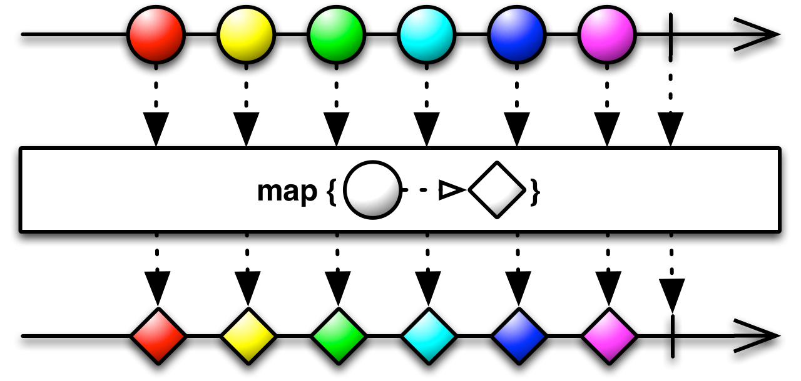
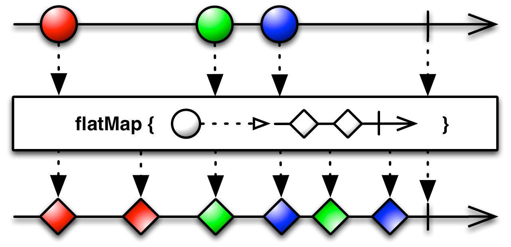
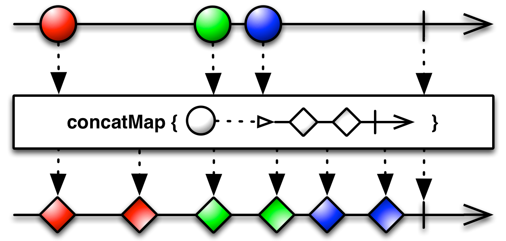
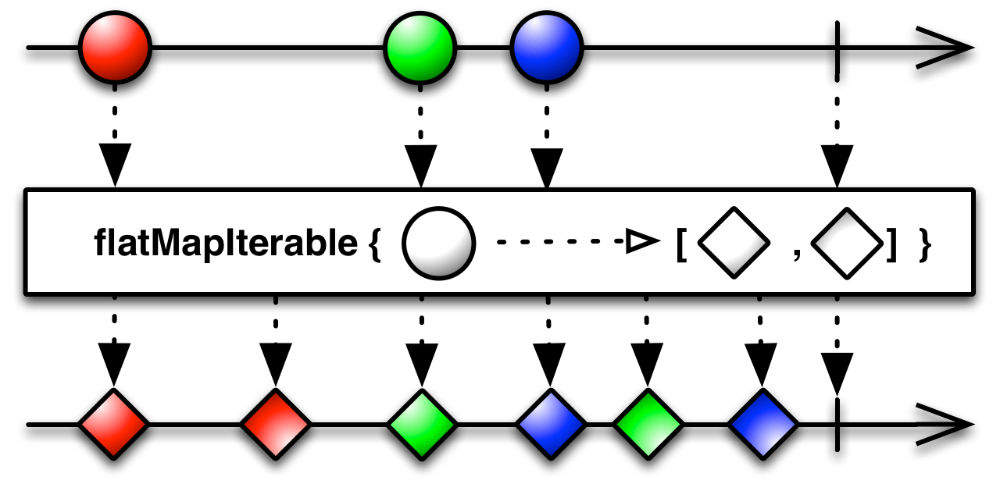
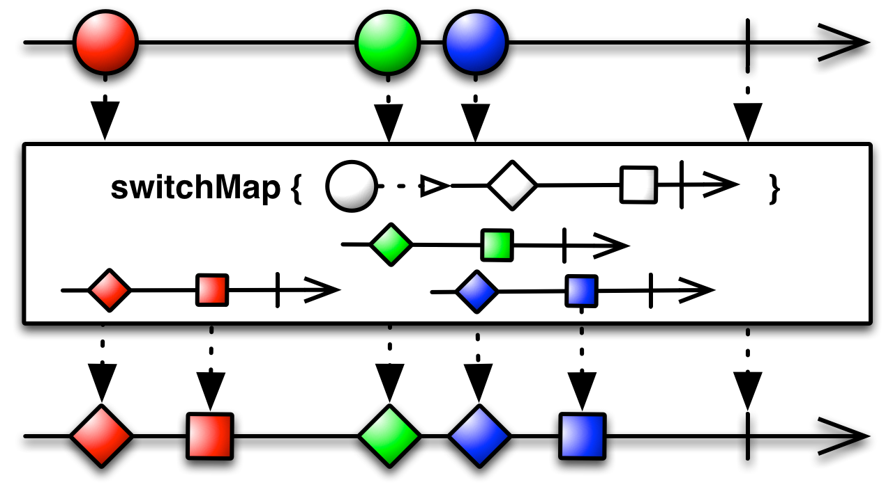
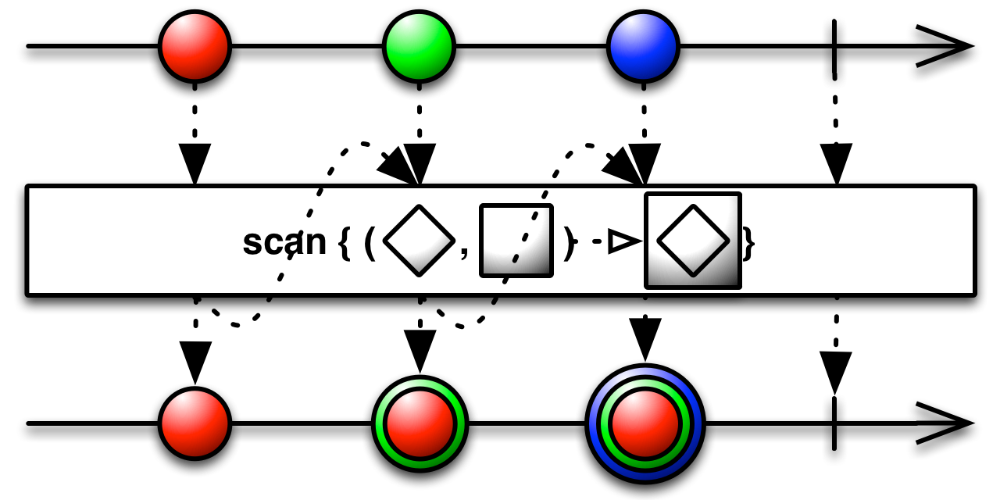
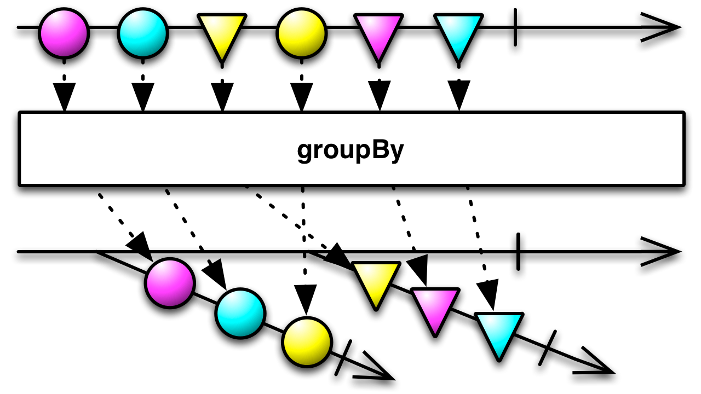

##RxJava系列三（转换操作符）
> 转载请注明出处：[http://www.jianshu.com/p/5970280703b9](http://www.jianshu.com/p/5970280703b9)

[RxJava系列1(简介)](http://www.jianshu.com/p/ec9849f2e510)  
[RxJava系列2(基本概念及使用介绍)](http://www.jianshu.com/p/ba61c047c230)  
[RxJava系列3(转换操作符)](http://www.jianshu.com/p/5970280703b9)  
[RxJava系列4(过滤操作符)](http://www.jianshu.com/p/3a188b995daa)  
[RxJava系列5(组合操作符)]()     
<u>RxJava系列6(源码分析)</u>    
<u>RxJava系列7(最佳实践)</u> 

***
前面两篇文章中我们介绍了RxJava的一些基本概念和RxJava最简单的用法。从这一章开始，我们开始聊聊RxJava中的操作符Operators，后面我将用三章的篇幅来分别介绍：

1. **转换类操作符**
2. **过滤类操作符**
3. **组合类操作符**

这一章我们主要讲讲转换类操作符。所有这些Operators都作用于一个可观测序列，然后变换它发射的值，最后用一种新的形式返回它们。概念实在是不好理解，下面我们结合实际的例子一一介绍。

####Map

**`map(Func1)`**函数接受一个Func1类型的参数(就像这样`map(Func1<? super T, ? extends R> func)`),然后吧这个Func1应用到每一个由Observable发射的值上，将发射的只转换为我们期望的值。这种狗屁定义我相信你也听不懂，我们来看一下官方给出的原理图：

假设我们需要将一组数字装换成字符串，我们可以通过map这样实现：

    Observable.just(1, 2, 3, 4, 5)
            .map(new Func1<Integer, String>() {

                @Override
                public String call(Integer i) {
                    return "This is " + i;
                }
            }).subscribe(new Action1<String>() {
                @Override
                public void call(String s) {
                    System.out.println(s);
                }
            });
            
 > Func1构造函数中的两个参数分别是Observable发射值当前的类型和map转换后的类型，上面这个例子中发射值当前的类型是Integer,转换后的类型是String。

####FlatMap
**`flatMap(Func1)`**函数同样也是做转换的，但是作用却不一样。flatMap不太好理解，我们直接看例子（*我们公司是个房产平台，那我就拿房子举例*）：假设我们有一组小区数据`Community[] communites`,现在我们要输出每个小区的名字；我们可以这样实现:

    Observable.from(communities)
            .map(new Func1<Community, String>() {

                @Override
                public String call(Community community) {
                    return community.name;
                }
            })
            .subscribe(new Action1<String>() {
                @Override
                public void call(String name) {
                    System.out.println("Community name : " + name);
                }
            });

现在我们需求有变化，需要打印出每个小区下面每一套房子的价格。于是我可以这样实现：

   	Community[] communities = {};
    Observable.from(communities)
            .subscribe(new Action1<Community>() {
                @Override
                public void call(Community community) {
                    for (House house : community.houses) {
                        System.out.println("House price : " + house.price);
                    }
                }
            });
            
            
如果我不想在Subscriber中使用for循环，而是希望Subscriber中直接传入单个的House对象呢？用map()显然是不行的，因为map()是一对一的转化，而我现在的要求是一对多的转化。那么我们可以使用flatMap()把一个Community转化成多个House。
            

    Observable.from(communities)
            .flatMap(new Func1<Community, Observable<House>>() {
                @Override
                public Observable<House> call(Community community) {
                    return Observable.from(community.houses);
                }
            })
            .subscribe(new Action1<House>() {
                @Override
                public void call(House house) {
                    System.out.println("House price : " + house.price);
                }
            });
            
            
从前面的例子中我们发现，flatMap()和map()都是把传入的参数转化之后返回另一个对象。但和map()不同的是，flatMap()中返回的是Observable对象，并且这个Observable对象并不是被直接发送到 Subscriber的回调方法中。

flatMap(Func1)的原理是这样的：

1. 将传入的事件对象装换成一个Observable对象；
2. 这是不会直接发送这个Observable, 而是将这个Observable激活让它自己开始发送事件；
3. 每一个创建出来的Observable发送的事件，都被汇入同一个Observable，这个Observable负责将这些事件统一交给Subscriber的回调方法。

这三个步骤，把事件拆成了两级，通过一组新创建的Observable将初始的对象『铺平』之后通过统一路径分发了下去。而这个『铺平』就是flatMap()所谓的flat。

最后我们来看看flatMap的原理图：

####ConcatMap
**`concatMap(Func1)`**解决了`flatMap()`的交叉问题，它能够把发射的值连续在一起，就像这样：

####flatMapIterable
**`flatMapIterable(Func1)`**和`flatMap()`几乎是一样的，不同的是`flatMapIterable()`它转化的多个Observable是使用Iterable作为源数据的。

    Observable.from(communities)
            .flatMapIterable(new Func1<Community, Iterable<House>>() {
                @Override
                public Iterable<House> call(Community community) {
                    return community.houses;
                }
            })
            .subscribe(new Action1<House>() {

                @Override
                public void call(House house) {

                }
            });

####SwitchMap
**`switchMap(Func1)`**和`flatMap(Func1)`很像，除了一点：每当源`Observable`发射一个新的数据项（Observable）时，它将取消订阅并停止监视之前那个数据项产生的`Observable`，并开始监视当前发射的这一个。

####Scan
**`scan(Func2)`**对一个序列的数据应用一个函数，并将这个函数的结果发射出去作为下个数据应用合格函数时的第一个参数使用。

我们来看个简单的例子：

    Observable.just(1, 2, 3, 4, 5)
            .scan(new Func2<Integer, Integer, Integer>() {
                @Override
                public Integer call(Integer integer, Integer integer2) {
                    return integer + integer2;
                }
            }).subscribe(new Action1<Integer>() {
        @Override
        public void call(Integer integer) {
            System.out.print(integer+“ ”);
        }
    });
    
 输出结果为：1 3 6 10 15  

####GroupBy
**`groupBy(Func1)`**将原始Observable发射的数据按照key来拆分成一些小的Observable，然后这些小Observable分别发射其所包含的的数据，和SQL中的groupBy类似。实际使用中，我们需要提供一个生成key的规则（也就是Func1中的call方法），所有key相同的数据会包含在同一个小的Observable中。另外我们还可以提供一个函数来对这些数据进行转化，有点类似于集成了flatMap。

单纯的文字描述和图片解释可能难以理解，我们来看个例子：假设我现在有一组房源`List<House> houses`,每套房子都属于某一个小区，现在我们需要根据小区名来对房源进行分类，然后依次将房源信息输出。

    List<House> houses = new ArrayList<>();
    houses.add(new House("中粮·海景壹号", "中粮海景壹号新出大平层！总价4500W起"));
    houses.add(new House("竹园新村", "满五唯一，黄金地段"));
    houses.add(new House("中粮·海景壹号", "毗邻汤臣一品"));
    houses.add(new House("竹园新村", "顶层户型，两室一厅"));
    houses.add(new House("中粮·海景壹号", "南北通透，豪华五房"));
    Observable<GroupedObservable<String, House>> groupByCommunityNameObservable = Observable.from(houses)
            .groupBy(new Func1<House, String>() {

                @Override
                public String call(House house) {
                    return house.communityName;
                }
            });
            
通过上面的代码我们创建了一个新的Observable:`groupByCommunityNameObservable`，它将会发送一个带有`GroupedObservable`的序列（也就是指发送的数据项的类型为GroupedObservable）。`GroupedObservable`是一个特殊的`Observable`，它基于一个分组的key，在这个例子中的key就是小区名。现在我们需要将分类后的房源依次输出：

    Observable.concat(groupByCommunityNameObservable)
            .subscribe(new Action1<House>() {
                @Override
                public void call(House house) {
                    System.out.println("小区:"+house.communityName+"; 房源描述:"+house.desc);
                }
            });

执行结果：

	小区:中粮·海景壹号; 房源描述:中粮海景壹号新出大平层！总价4500W起
	小区:中粮·海景壹号; 房源描述:毗邻汤臣一品
	小区:中粮·海景壹号; 房源描述:南北通透，豪华五房
	小区:竹园新村; 房源描述:满五唯一，黄金地段
	小区:竹园新村; 房源描述:顶层户型，两室一厅
	
转换类的操作符就先介绍到这，后续还会继续介绍组合、过滤类的操作符及源码分析，敬请期待！