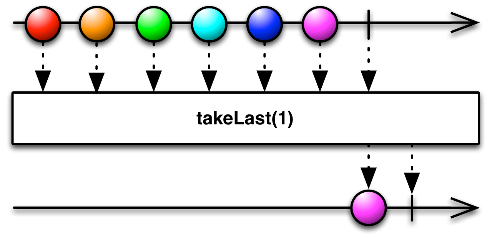
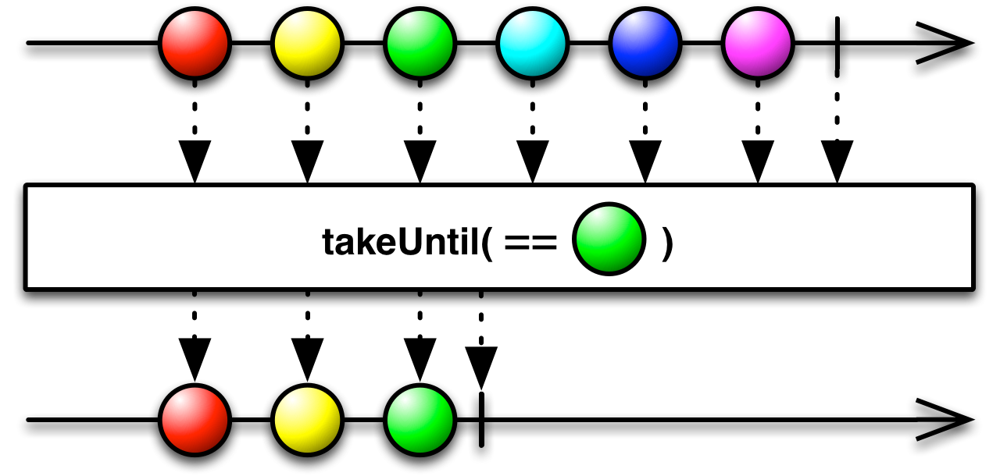
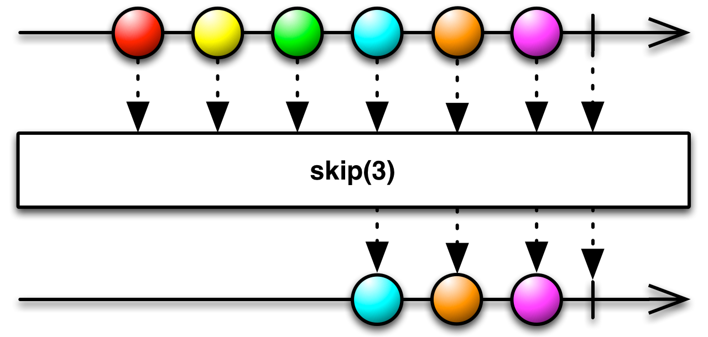
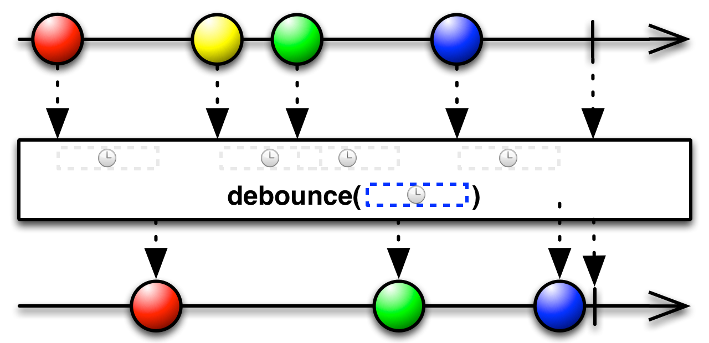
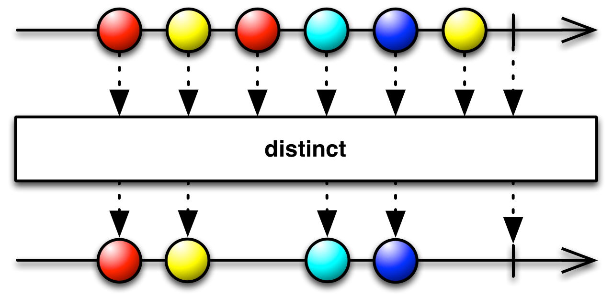
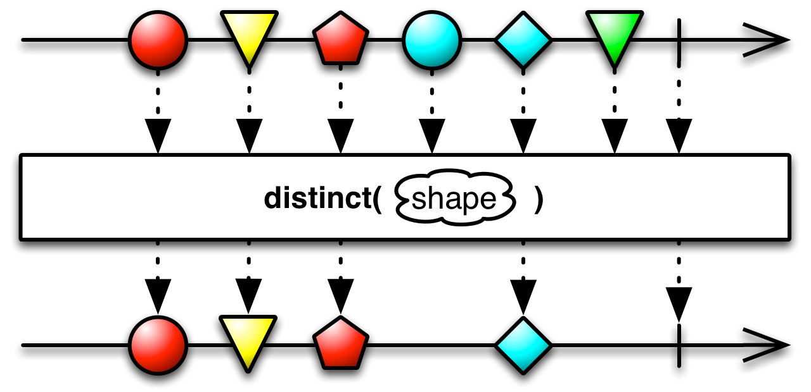
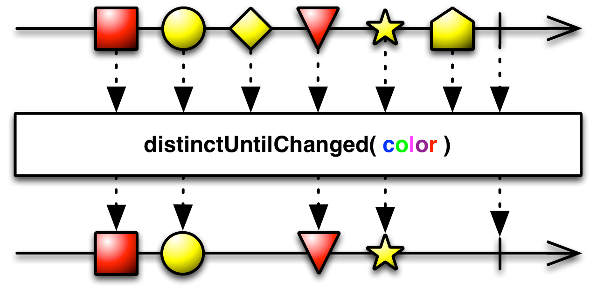
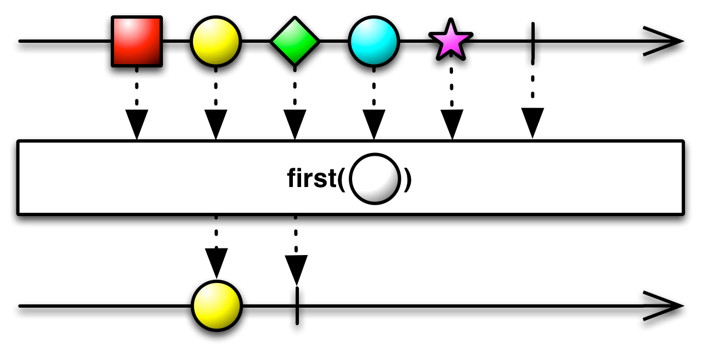
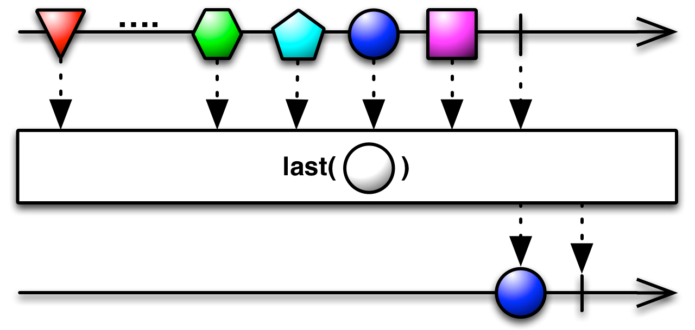

# RxJava系列四（过滤操作符）
> 转载请注明出处：[https://zhuanlan.zhihu.com/p/21966621](https://zhuanlan.zhihu.com/p/21966621)

* [RxJava系列1(简介)](https://zhuanlan.zhihu.com/p/20687178)
* [RxJava系列2(基本概念及使用介绍)](https://zhuanlan.zhihu.com/p/20687307)
* [RxJava系列3(转换操作符)](https://zhuanlan.zhihu.com/p/21926591)
* [RxJava系列4(过滤操作符)](https://zhuanlan.zhihu.com/p/21966621)
* [RxJava系列5(组合操作符)](https://zhuanlan.zhihu.com/p/22039934)
* [RxJava系列6(从微观角度解读RxJava源码)](https://zhuanlan.zhihu.com/p/22338235)   
* [RxJava系列7(最佳实践)](https://zhuanlan.zhihu.com/p/23108381)   

***
前面一篇文章中我们介绍了转换类操作符，那么这一章我们就来介绍下过滤类的操作符。顾名思义，这类operators主要用于对事件数据的筛选过滤，只返回满足我们条件的数据。过滤类操作符主要包含： **`Filter`** **`Take`** **`TakeLast`** **`TakeUntil`** **`Skip`** **`SkipLast`** **`ElementAt`** **`Debounce`** **`Distinct`** **`DistinctUntilChanged`** **`First`** **`Last`**等等。

### Filter
**`filter(Func1)`**用来过滤观测序列中我们不想要的值，只返回满足条件的值，我们看下原理图：


还是拿前面文章中的小区`Community[] communities`来举例，假设我需要赛选出所有房源数大于10个的小区，我们可以这样实现：

```java
Observable.from(communities)
        .filter(new Func1<Community, Boolean>() {
            @Override
            public Boolean call(Community community) {
                return community.houses.size()>10;
            }
        }).subscribe(new Action1<Community>() {
    @Override
    public void call(Community community) {
        System.out.println(community.name);
    }
}); 
```

### Take
**`take(int)`**用一个整数n作为一个参数，从原始的序列中发射前n个元素.


现在我们需要取小区列表`communities`中的前10个小区

```java
Observable.from(communities)
        .take(10)
        .subscribe(new Action1<Community>() {
            @Override
            public void call(Community community) {
                System.out.println(community.name);
            }
        });
```     

### TakeLast
**`takeLast(int)`**同样用一个整数n作为参数，只不过它发射的是观测序列中后n个元素。


获取小区列表`communities`中的后3个小区

```java
Observable.from(communities)
        .takeLast(3)
        .subscribe(new Action1<Community>() {
            @Override
            public void call(Community community) {
                System.out.println(community.name);
            }
        });
```

### TakeUntil
**`takeUntil(Observable)`**订阅并开始发射原始Observable，同时监视我们提供的第二个Observable。如果第二个Observable发射了一项数据或者发射了一个终止通知，`takeUntil()`返回的Observable会停止发射原始Observable并终止。


```java
Observable<Long> observableA = Observable.interval(300, TimeUnit.MILLISECONDS);
Observable<Long> observableB = Observable.interval(800, TimeUnit.MILLISECONDS);

observableA.takeUntil(observableB)
        .subscribe(new Subscriber<Long>() {
            @Override
            public void onCompleted() {
                System.exit(0);
            }

            @Override
            public void onError(Throwable e) {

            }

            @Override
            public void onNext(Long aLong) {
                System.out.println(aLong);
            }
        });

try {
    Thread.sleep(Integer.MAX_VALUE);
} catch (InterruptedException e) {
    e.printStackTrace();
}
```

程序输出：

	0
	1


**`takeUntil(Func1)`**通过Func1中的call方法来判断是否需要终止发射数据。


```java
Observable.just(1, 2, 3, 4, 5, 6, 7)
                .takeUntil(new Func1<Integer, Boolean>() {
                    @Override
                    public Boolean call(Integer integer) {
                        return integer >= 5;
                    }
                }).subscribe(new Action1<Integer>() {
            @Override
            public void call(Integer integer) {
                System.out.println(integer);
            }
        });
```

程序输出：

	1
	2
	3
	4
	5


###Skip
**`skip(int)`**让我们可以忽略Observable发射的前n项数据。


过滤掉小区列表`communities`中的前5个小区

```java
Observable.from(communities)
        .skip(5)
        .subscribe(new Action1<Community>() {
            @Override
            public void call(Community community) {
                System.out.println(community.name);
            }
        });
```        

### SkipLast
**`skipLast(int)`**忽略Observable发射的后n项数据。


### ElementAt
**`elementAt(int)`**用来获取元素Observable发射的事件序列中的第n项数据，并当做唯一的数据发射出去。


### Debounce
**`debounce(long, TimeUnit)`**过滤掉了由Observable发射的速率过快的数据；如果在一个指定的时间间隔过去了仍旧没有发射一个，那么它将发射最后的那个。通常我们用来结合RxBing(Jake Wharton大神使用RxJava封装的Android UI组件)使用，防止button重复点击。


**`debounce(Func1)`**可以根据Func1的call方法中的函数来过滤，Func1中的中的call方法返回了一个临时的Observable，如果原始的Observable在发射一个新的数据时，上一个数据根据Func1的call方法生成的临时Observable还没结束，那么上一个数据就会被过滤掉。


### Distinct
**`distinct()`**的过滤规则是只允许还没有发射过的数据通过，所有重复的数据项都只会发射一次。


过滤掉一段数字中的重复项：

```java
Observable.just(2, 1, 2, 2, 3, 4, 3, 4, 5, 5)
        .distinct()
        .subscribe(new Action1<Integer>() {
            @Override
            public void call(Integer i) {
                System.out.print(i + " ");
            }
        });
```
            
程序输出：
	
	2 1 3 4 5 

**`distinct(Func1)`**参数中的Func1中的call方法会根据Observable发射的值生成一个Key，然后比较这个key来判断两个数据是不是相同；如果判定为重复则会和`distinct()`一样过滤掉重复的数据项。


假设我们要过滤掉一堆房源中小区名重复的小区：

```java
List<House> houses = new ArrayList<>();
//House构造函数中的第一个参数为该房源所属小区名，第二个参数为房源描述
List<House> houses = new ArrayList<>();
houses.add(new House("中粮·海景壹号", "中粮海景壹号新出大平层！总价4500W起"));
houses.add(new House("竹园新村", "满五唯一，黄金地段"));
houses.add(new House("竹园新村", "一楼自带小花园"));
houses.add(new House("中粮·海景壹号", "毗邻汤臣一品"));
houses.add(new House("中粮·海景壹号", "顶级住宅，给您总统般尊贵体验"));
houses.add(new House("竹园新村", "顶层户型，两室一厅"));
houses.add(new House("中粮·海景壹号", "南北通透，豪华五房"));
Observable.from(houses)
        .distinct(new Func1<House, String>() {

            @Override
            public String call(House house) {
                return house.communityName;
            }
        }).subscribe(new Action1<House>() {
            @Override
            public void call(House house) {
                System.out.println("小区:" + house.communityName + "; 房源描述:" + house.desc);
            }
        });            
```
           
程序输出：

	小区:中粮·海景壹号; 房源描述:中粮海景壹号新出大平层！总价4500W起
	小区:竹园新村; 房源描述:满五唯一，黄金地段

### DistinctUntilChanged
**`distinctUntilChanged()`**和`distinct()`类似，只不过它判定的是Observable发射的当前数据项和前一个数据项是否相同。


同样还是上面过滤数字的例子：

```
Observable.just(2, 1, 2, 2, 3, 4, 3, 4, 5, 5)
        .distinctUntilChanged()
        .subscribe(new Action1<Integer>() {
            @Override
            public void call(Integer i) {
                System.out.print(i + " ");
            }
        });
```
      
程序输出：
	
	2 1 2 3 4 3 4 5 

**`distinctUntilChanged(Func1)`**和`distinct(Func1)`一样，根据Func1中call方法产生一个Key来判断两个相邻的数据项是否相同。


我们还是拿前面的过滤房源的例子：

```java
Observable.from(houses)
        .distinctUntilChanged(new Func1<House, String>() {

            @Override
            public String call(House house) {
                return house.communityName;
            }
        }).subscribe(new Action1<House>() {
    @Override
    public void call(House house) {
        System.out.println("小区:" + house.communityName + "; 房源描述:" + house.desc);
    }
});
```
    
程序输出：

	小区:中粮·海景壹号; 房源描述:中粮海景壹号新出大平层！总价4500W起
	小区:竹园新村; 房源描述:满五唯一，黄金地段
	小区:中粮·海景壹号; 房源描述:毗邻汤臣一品
	小区:竹园新村; 房源描述:顶层户型，两室一厅
	小区:中粮·海景壹号; 房源描述:南北通透，豪华五房


### First
**`first()`**顾名思义，它是的Observable只发送观测序列中的第一个数据项。


获取房源列表`houses`中的第一套房源：

```java
Observable.from(houses)
        .first()
        .subscribe(new Action1<House>() {
            @Override
            public void call(House house) {
                System.out.println("小区:" + house.communityName + "; 房源描述:" + house.desc);
            }                
        });
```

程序输出：

	小区:中粮·海景壹号; 房源描述:中粮海景壹号新出大平层！总价4500W起

**`first(Func1)`**只发送符合条件的第一个数据项。


现在我们要获取房源列表`houses`中小区名为*竹园新村*的第一套房源。

```java
Observable.from(houses)
        .first(new Func1<House, Boolean>() {
            @Override
            public Boolean call(House house) {
                return "竹园新村".equals(house.communityName);
            }
        })
        .subscribe(new Action1<House>() {
            @Override
            public void call(House house) {
                System.out.println("小区:" + house.communityName + "; 房源描述:" + house.desc);
            }
        });
```
            
程序输出：

	小区:竹园新村; 房源描述:满五唯一，黄金地段

### Last
**`last()`**只发射观测序列中的最后一个数据项。


获取房源列表中的最后一套房源：

```java
Observable.from(houses)
        .last()
        .subscribe(new Action1<House>() {
            @Override
            public void call(House house) {
                System.out.println("小区:" + house.communityName + "; 房源描述:" + house.desc);
            }
        });
```
           
程序输出：

	小区:中粮·海景壹号; 房源描述:南北通透，豪华五房

**`last(Func1)`**只发射观测序列中符合条件的最后一个数据项。


获取房源列表`houses`中小区名为*竹园新村*的最后一套房源：

```java
Observable.from(houses)
        .last(new Func1<House, Boolean>() {
            @Override
            public Boolean call(House house) {
                return "竹园新村".equals(house.communityName);
            }
        })
        .subscribe(new Action1<House>() {
            @Override
            public void call(House house) {
                System.out.println("小区:" + house.communityName + "; 房源描述:" + house.desc);
            }
        });
```
        
程序输出：

	小区:竹园新村; 房源描述:顶层户型，两室一厅

这一章我们就先聊到这，更多的过滤类操作符的介绍大家可以去查阅官方文档和源码；在下一章我们将继续介绍组合类操作符。

> 如果大家喜欢这一系列的文章，欢迎关注我的知乎专栏、GitHub、简书博客。
>   
> * 知乎专栏：[https://zhuanlan.zhihu.com/baron](https://zhuanlan.zhihu.com/baron)  
> * GitHub：[https://github.com/BaronZ88](https://github.com/BaronZ88)  
> * 简书博客：[http://www.jianshu.com/users/cfdc52ea3399](http://www.jianshu.com/users/cfdc52ea3399) 


