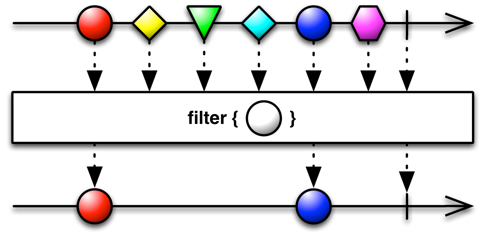
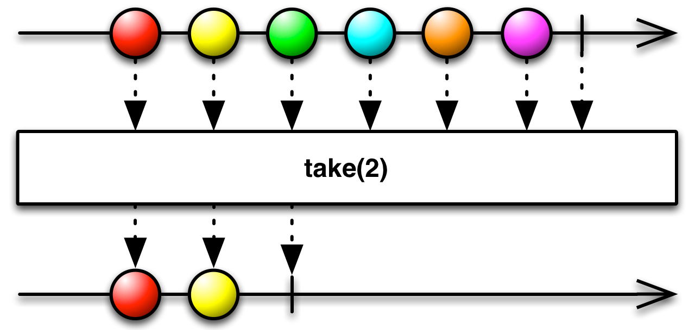
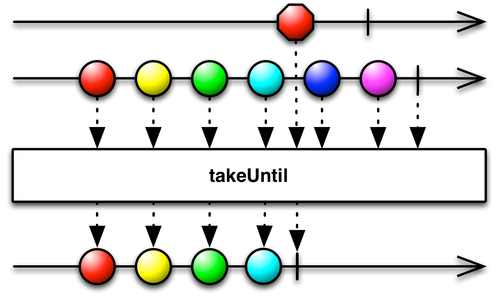
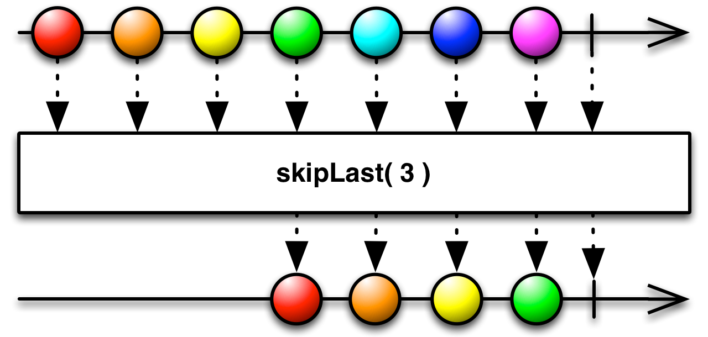
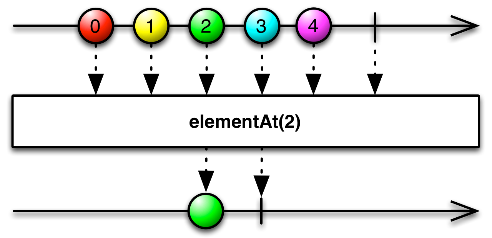
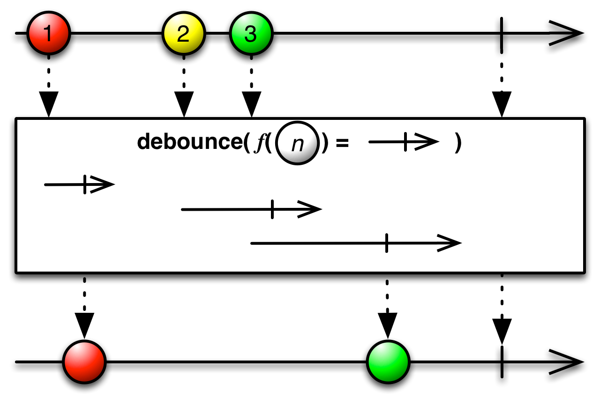
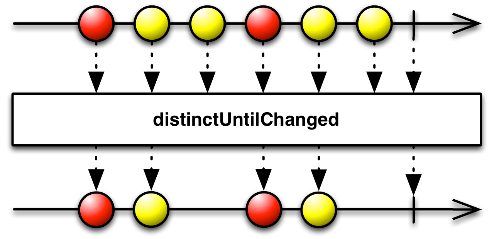
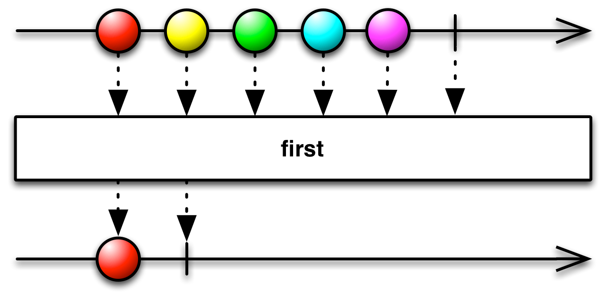
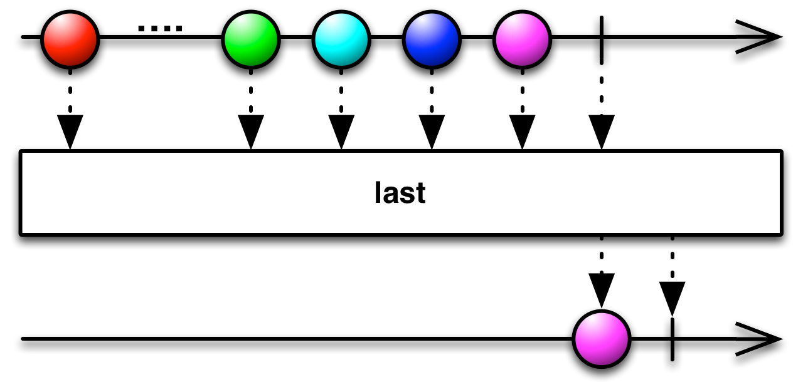

##RxJava系列四（过滤操作符）
> 转载请注明出处：

[RxJava系列1(简介)](http://www.jianshu.com/p/ec9849f2e510)  
[RxJava系列2(基本概念及使用介绍)](http://www.jianshu.com/p/ba61c047c230)  
[RxJava系列3(转换操作符)](http://www.jianshu.com/p/5970280703b9)  
[RxJava系列4(过滤操作符)]()  
<u>RxJava系列5(组合操作符)</u>     
<u>RxJava系列6(源码分析)</u>    
<u>RxJava系列7(最佳实践)</u> 

***
前面一篇文章中我们介绍了转换类操作符，那么这一章我们就来介绍下过滤类的操作符。顾名思义，这类operators主要用于对事件数据的筛选过滤，只返回满足我们条件的数据。过滤类操作符主要包含：`filter` `take` `takeLast` `takeUntil` `debounce` `distinct` `distinctUntilChanged` `skip` `skipLast`等等。

###Filter
`filter(Func1)`用来过滤观测序列中我们不想要的值，只返回满足条件的值，我们看下原理图：

还是拿前面文章中的小区`Community[] communities`来举例，假设我需要赛选出所有房源数大于10个的小区，我们可以这样实现：

    Observable.from(communities)
            .filter(new Func1<Community, Boolean>() {
                @Override
                public Boolean call(Community community) {
                    return community.houses.size()>10;
                }
            }).subscribe(new Action1<Community>() {
        @Override
        public void call(Community community) {
            System.out.println(community.name);
        }
    });

###Take
`take(int)`用一个整数n作为一个参数，从原始的序列中发射前n个元素.

现在我们需要取小区列表`communities`中的前10个小区

    Observable.from(communities)
            .take(10)
            .subscribe(new Action1<Community>() {
                @Override
                public void call(Community community) {
                    System.out.println(community.name);
                }
            });
     

###TakeLast
`takeLast(int)`同样用一个整数n作为参数，只不过它发射的是观测序列中后n个元素。

###TakeUntil
`takeUntil(Observable)`订阅并开始发射原始Observable，同时监视我们提供的第二个Observable。如果第二个Observable发射了一项数据或者发射了一个终止通知，`takeUntil()`返回的Observable会停止发射原始Observable并终止。

`takeUntil(Func1)`通过Func1中的call方法来判断是否需要终止发射数据。

###Skip
`skip(int)`让我们可以忽略Observable发射的前n项数据。

###skipLast
`skipLast(int)`忽略Observable发射的后n项数据。

###ElementAt
`elementAt(int)`用来获取元素Observable发射的事件序列中的第n项数据，并当做唯一的数据发射出去。

###Debounce
`debounce(long, TimeUnit)`过滤掉了由Observable发射的速率过快的数据；如果在一个指定的时间间隔过去了仍旧没有发射一个，那么它将发射最后的那个。通常我们用来结合RxBing(Jake Wharton大神使用RxJava封装的Android UI组件)使用，防止button重复点击。

`debounce(Func1)`可以根据Func1的call方法中的函数来过滤，Func1中的中的call方法返回了一个临时的Observable，如果原始的Observable在发射一个新的数据时，上一个数据根据Func1的call方法生成的临时Observable还没结束，那么上一个数据就会被过滤掉。

###Distinct
`distinct()`

###DistinctUntilChanged
`distinctUntilChanged()`

###First
`first()`

`first(Func1)`

###Last
`last()`

