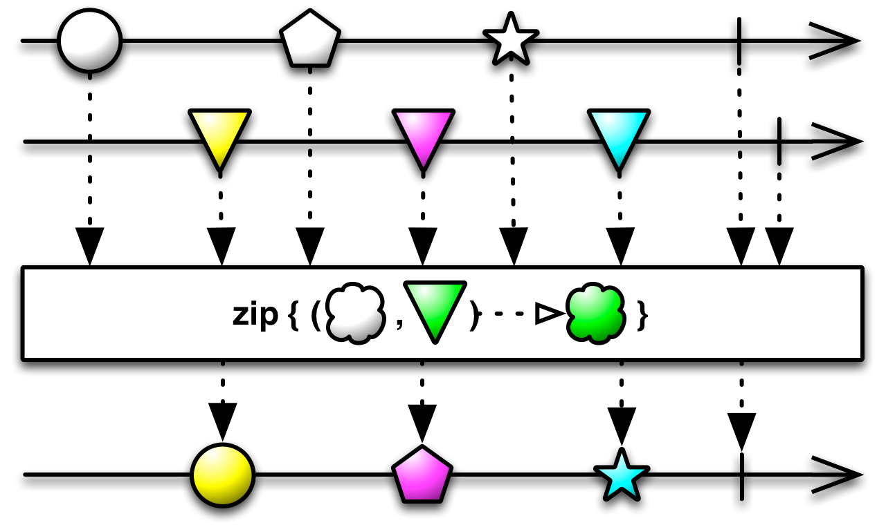

##RxJava系列五（组合操作符）
> 转载请注明出处：

[RxJava系列1(简介)](http://www.jianshu.com/p/ec9849f2e510)  
[RxJava系列2(基本概念及使用介绍)](http://www.jianshu.com/p/ba61c047c230)  
[RxJava系列3(转换操作符)](http://www.jianshu.com/p/5970280703b9)  
[RxJava系列4(过滤操作符)](http://www.jianshu.com/p/3a188b995daa)  
[RxJava系列5(组合操作符)]()     
<u>RxJava系列6(源码分析)</u>    
<u>RxJava系列7(最佳实践)</u> 

***
这一章我们接着介绍组合操作符，这类operators可以同时处理多个Observable来创建我们所需要的Observable。组合操作符主要包含： **`Merge`** **`Zip`** **`Join`** **`CombineLatest`** **`And/Then/When`** **`Switch`** **`StartWith`**等等。

###Merge
**`merge(Observable, Observable)`**将亮个Observable发射的事件序列组合并成一个事件序列，就像是一个Observable发射的一样。你可以简单的将它理解为两个Obsrvable合并成了一个Observable。

**`merge(Observable[])`**将多个Observable发射的事件序列组合并成一个事件序列，就像是一个Observable发射的一样。
![merge(Observable[])](MergeIOOperator.png)

###Zip
**`zip(Observable, Observable, Func2)`**用来合并两个Observable发射的数据项，根据Func2函数生成一个新的值并发射出去。

###Join
**`join(Observable, Func1, Func1, Func2)`**
我们先介绍下join操作符的4个参数：

* Observable:源Observable需要组合的Observable
* Func1:
* Func1:
* Func2:

###CombineLatest

###And/Then/When

###Switch

###StartWith

