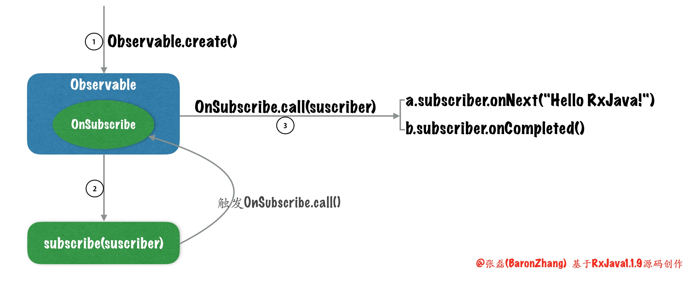
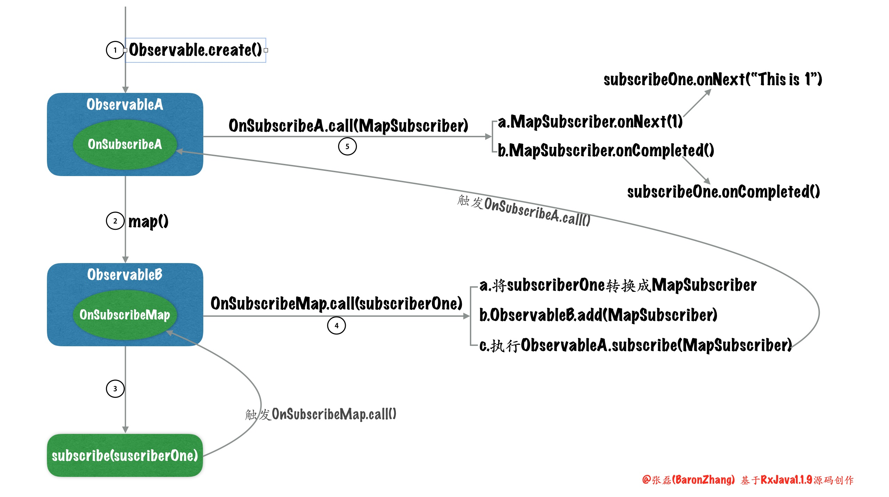
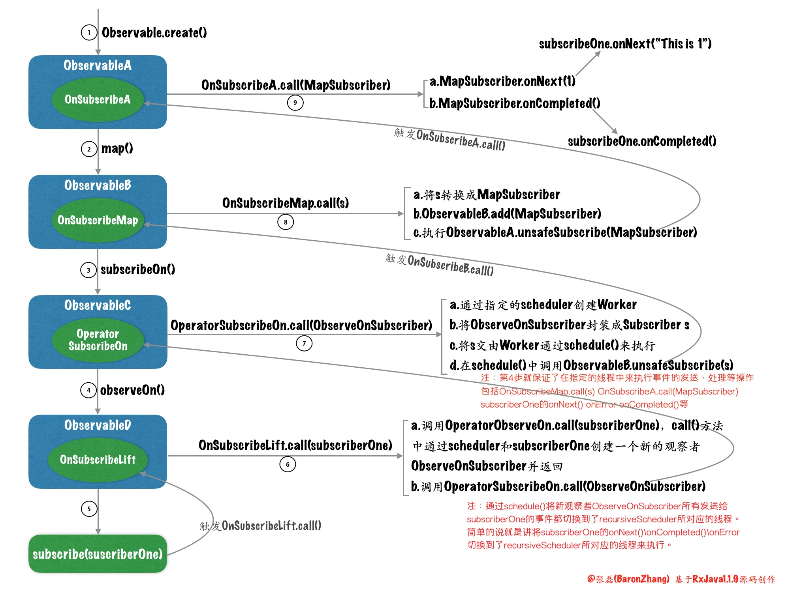

#[深度干货]RxJava系列6(从微观角度解读RxJava源码)
> 转载请注明出处：[]()

* [RxJava系列1(简介)](http://www.jianshu.com/p/ec9849f2e510)
* [RxJava系列2(基本概念及使用介绍)](http://www.jianshu.com/p/ba61c047c230)
* [RxJava系列3(转换操作符)](http://www.jianshu.com/p/5970280703b9)
* [RxJava系列4(过滤操作符)](http://www.jianshu.com/p/3a188b995daa)
* [RxJava系列5(组合操作符)](http://www.jianshu.com/p/546fe44a6e22)
* [\[深度干货\]RxJava系列6(从微观角度解读RxJava源码)]()   
* <u>\[深度干货\]RxJava系列7(从宏观角度解读RxJava源码)</u>  
* <u>RxJava系列8(最佳实践)</u>  

***

##前言
通过前面五个篇幅的介绍，大家对RxJava的基本使用以及操作符应该有了一定的认识。但是知其然还要知其所以然，所以从这一章开始我们解读源码，分析RxJava的实现原理。本文我们主要从三个方面来分析RxJava的源码实现：

* RxJava基本流程分析
* 操作符原理分析
* 线程调度原理分析

> 本章节基于**RxJava1.1.9**版本的源码

##一、RxJava执行流程分析

在[RxJava系列2(基本概念及使用介绍)](http://www.jianshu.com/p/ba61c047c230)中我们介绍过，一个RxJava中最基本的调用是这样的：

**示例A**

```java
Observable.create(new Observable.OnSubscribe<String>() {
    @Override
    public void call(Subscriber<? super String> subscriber) {
        subscriber.onNext("Hello RxJava!");
        subscriber.onCompleted();
    }
}).subscribe(new Subscriber<String>() {
    @Override
    public void onCompleted() {
        System.out.println("completed!");
    }
    @Override
    public void onError(Throwable e) {
    }
    @Override
    public void onNext(String s) {
        System.out.println(s);
    }
});
```

首先调用`Observable.create()`创建一个被观察者`Observable`，同时创建一个`OnSubscribe`作为`create()`方法的入参；接着创建一个观察者`Subscriber`，然后通过`subseribe()`实现二者的订阅关系。这里涉及到三个关键对象和一个核心的方法：

* **Observable**（被观察者）
* **OnSubscribe**
* **Subscriber** （观察者）
* **subscribe()** （实现观察者与被观察者订阅关系的方法）

###1、Observable.create()源码分析

首先我们来看看`Observable.create()`的实现:

```java
public static <T> Observable<T> create(OnSubscribe<T> f) {
	return new Observable<T>(RxJavaHooks.onCreate(f));
}
```
这里创建了一个被观察者`Observable`，同时将`RxJavaHooks.onCreate(f)`作为构造函数的参数，源码如下：

```java
protected Observable(OnSubscribe<T> f) {
	this.onSubscribe = f;
}
```

我们看到源码中直接将参数`RxJavaHooks.onCreate(f)`赋值给了当前我们构造的被观察者`Observable`的成员变量`onSubscribe`。那么`RxJavaHooks.onCreate(f)`返回的又是什么呢？我们接着往下看：

```java
public static <T> Observable.OnSubscribe<T> onCreate(Observable.OnSubscribe<T> onSubscribe) {
    Func1<OnSubscribe, OnSubscribe> f = onObservableCreate;
    if (f != null) {
        return f.call(onSubscribe);
    }
    return onSubscribe;
}
```

由于我们并没调用`RxJavaHooks.initCreate()`，所以上面代码中的`onObservableCreate`为null；因此`RxJavaHooks.onCreate(f)`最终返回的就是`f`，也就是我们在`Observable.create()`的时候new出来的`OnSubscribe`。（*由于对RxJavaHooks的理解并不影响我们对RxJava执行流程的分析，因此在这里我们不做进一步的探讨。为了方便理解我们只需要知道RxJavaHooks一系列方法的返回值就是入参本身就OK了，例如这里的`RxJavaHooks.onCreate(f)`返回的就是`f`*）。

至此我们做下逻辑梳理：**`Observable.create()`方法构造了一个被观察者`Observable`对象，同时将new出来的`OnSubscribe`赋值给了该`Observable`的成员变量`onSubscribe`。**

###2、Subscriber源码分析

接着我们看下观察者`Subscriber`的源码，为了增加可读性，我去掉了源码中的注释和部分代码。

```java
public abstract class Subscriber<T> implements Observer<T>, Subscription {
    
    private static final long NOT_SET = Long.MIN_VALUE;

    private final SubscriptionList subscriptions;//订阅事件集
    private final Subscriber<?> subscriber;
    private Producer producer;
    private long requested = NOT_SET;

    ...

    protected Subscriber(Subscriber<?> subscriber, boolean shareSubscriptions) {
        this.subscriber = subscriber;
        this.subscriptions = shareSubscriptions && subscriber != null ? subscriber.subscriptions : new SubscriptionList();
    }

    public final void add(Subscription s) {
        subscriptions.add(s);
    }

    @Override
    public final void unsubscribe() {
        subscriptions.unsubscribe();
    }

    @Override
    public final boolean isUnsubscribed() {
        return subscriptions.isUnsubscribed();
    }

    public void onStart() {
    }
    
    protected final void request(long n) {
        if (n < 0) {
            throw new IllegalArgumentException("number requested cannot be negative: " + n);
        } 
        
        Producer producerToRequestFrom = null;
        synchronized (this) {
            if (producer != null) {
                producerToRequestFrom = producer;
            } else {
                addToRequested(n);
                return;
            }
        }
        producerToRequestFrom.request(n);
    }

    private void addToRequested(long n) {
        if (requested == NOT_SET) {
            requested = n;
        } else { 
            final long total = requested + n;
            if (total < 0) {
                requested = Long.MAX_VALUE;
            } else {
                requested = total;
            }
        }
    }
    
    public void setProducer(Producer p) {
        long toRequest;
        boolean passToSubscriber = false;
        synchronized (this) {
            toRequest = requested;
            producer = p;
            if (subscriber != null) {
                if (toRequest == NOT_SET) {
                    passToSubscriber = true;
                }
            }
        }
        if (passToSubscriber) {
            subscriber.setProducer(producer);
        } else {
            if (toRequest == NOT_SET) {
                producer.request(Long.MAX_VALUE);
            } else {
                producer.request(toRequest);
            }
        }
    }
}
```

```java
public interface Subscription {
    void unsubscribe();
    boolean isUnsubscribed();
}
```

`Subscriber`实现了`Subscription`接口，从而对外提供`isUnsubscribed()`和`unsubscribe()`方法。前者用于判断是否已经取消订阅；后者用于将订阅事件列表(*也就是当前观察者的成员变量`subscriptions`*)中的所有`Subscription`取消订阅，并且不再接受观察者`Observable`发送的后续事件。

###3、subscribe()源码分析
前面我们分析了观察者和被观察者相关的源码，那么接下来便是整个订阅流程中最最关键的环节了。

```java
public final Subscription subscribe(Subscriber<? super T> subscriber) {
    return Observable.subscribe(subscriber, this);
}
```

```java
static <T> Subscription subscribe(Subscriber<? super T> subscriber, Observable<T> observable) {

	...

    subscriber.onStart();
    
    if (!(subscriber instanceof SafeSubscriber)) {
        subscriber = new SafeSubscriber<T>(subscriber);
    }

    try {
        RxJavaHooks.onObservableStart(observable, observable.onSubscribe).call(subscriber);

        return RxJavaHooks.onObservableReturn(subscriber);
    } catch (Throwable e) {
        ...
        return Subscriptions.unsubscribed();
    }
}
```

`subscribe()`方法中将传进来的`subscriber`包装成了`SafeSubscriber`，`SafeSubscriber`其实是`subscriber`的一个代理，对`subscriber`的一系列方法做了更加严格的安全校验。保证了`onCompleted()`和`onError()`只会有一个被执行且只执行一次，一旦它们其中方法被执行过后`onNext()`就不在执行了。

上述代码中最关键的就是`RxJavaHooks.onObservableStart(observable, observable.onSubscribe).call(subscriber)`。这里的RxJavaHooks和之前提到的一样，`RxJavaHooks.onObservableStart(observable, observable.onSubscribe)`返回的正是他的第二个入参`observable.onSubscribe`，也就是当前`observable`的成员变量`onSubscribe`。而这个成员变量我们前面提到过，它是我们在`Observable.create()`的时候new出来的。所以这段代码可以简化为`onSubscribe.call(subscriber)`。这也印证了我在[RxJava系列2(基本概念及使用介绍)](http://www.jianshu.com/p/ba61c047c230)中说的，`onSubscribe.call(subscriber)`中的`subscriber`正是我们在`subscribe()`方法中new出来的观察者。

到这里，我们对RxJava的执行流程做个总结：首先我们调用`crate()`创建一个观察者，同时创建一个`OnSubscribe`作为该方法的入参；接着调用`subscribe()`来订阅我们自己创建的观察者`Subscriber`。
一旦调用`subscribe()`方法后就会触发执行`OnSubscribe.call()`。然后我们就可以在call方法调用观察者`subscriber`的`onNext()`,`onCompleted()`,`onError()`。

最后我用张图来总结下之前的分析结果：



##二、操作符源码分析
之前我们介绍过几十个操作符，要一一分析它们的源码显然不太现实。在这里我抛砖引玉，选取一个相对简单且常用的`map`操作符来z做分析。

我们先来看一个`map`操作符的简单应用：

**示例B**

```java
Observable.create(new Observable.OnSubscribe<Integer>() {
    @Override
    public void call(Subscriber<? super Integer> subscriber) {
        subscriber.onNext(1);
        subscriber.onCompleted();
    }
}).map(new Func1<Integer, String>() {
    @Override
    public String call(Integer integer) {
        return "This is " + integer;
    }
}).subscribe(new Subscriber<String>() {
    @Override
    public void onCompleted() {
        System.out.println("onCompleted!");
    }
    @Override
    public void onError(Throwable e) {
        System.out.println(e.getMessage());
    }
    @Override
    public void onNext(String s) {
        System.out.println(s);
    }
});
```

为了后面分析源码的时候便于表述，我将上面的代码做了如下拆解：

```java
Observable<Integer> observableA = Observable.create(new Observable.OnSubscribe<Integer>() {
    @Override
    public void call(Subscriber<? super Integer> subscriber) {
        subscriber.onNext(1);
        subscriber.onCompleted();
    }
});

Subscriber<String> subscriberOne = new Subscriber<String>() {
    @Override
    public void onCompleted() {
        System.out.println("onCompleted!");
    }
    @Override
    public void onError(Throwable e) {
        System.out.println(e.getMessage());
    }
    @Override
    public void onNext(String s) {
        System.out.println(s);
    }
};

Observable<String> observableB = 
        observableA.map(new Func1<Integer, String>() {
                @Override
                public String call(Integer integer) {
                    return "This is " + integer;;
                }
            });

observableB.subscribe(subscriberOne);
```

`map()`的源码和上一小节介绍的`create()`一样位于`Observable`这个类中。

```java
public final <R> Observable<R> map(Func1<? super T, ? extends R> func) {
    return create(new OnSubscribeMap<T, R>(this, func));
}
```

通过查看源码我们发现调用`map()`的时候实际上是创建了一个新的被观察者`Observable`，我们姑且称它为`ObservableB`；一开始通过`Observable.create()`创建的`Observable`我们称之为`ObservableA`。在创建`ObservableB`的时候同时创建了一个`OnSubscribeMap`，而`ObservableA`和变换函数`Func1`则作为构造`OnSubscribeMap`的参数。


```java
public final class OnSubscribeMap<T, R> implements OnSubscribe<R> {

    final Observable<T> source;//ObservableA
    
    final Func1<? super T, ? extends R> transformer;//map操作符中的转换函数Func1。T为转换前的数据类型，在上面的例子中为Integer；R为转换后的数据类型，在该例中为String。

    public OnSubscribeMap(Observable<T> source, Func1<? super T, ? extends R> transformer) {
        this.source = source;
        this.transformer = transformer;
    }
    
    @Override
    public void call(final Subscriber<? super R> o) {//结合第一小节的分析结果，我们知道这里的入参o其实就是我们自己new的观察者subscriberOne。
        MapSubscriber<T, R> parent = new MapSubscriber<T, R>(o, transformer);
        o.add(parent);
        source.unsafeSubscribe(parent);
    }
    
    static final class MapSubscriber<T, R> extends Subscriber<T> {
        
        final Subscriber<? super R> actual;//这里的actual就是我们在调用subscribe()时创建的观察者mSubscriber
        final Func1<? super T, ? extends R> mapper;//变换函数
        boolean done;
        
        public MapSubscriber(Subscriber<? super R> actual, Func1<? super T, ? extends R> mapper) {
            this.actual = actual;
            this.mapper = mapper;
        }
        
        @Override
        public void onNext(T t) {
            R result;
            try {
                result = mapper.call(t);
            } catch (Throwable ex) {
                Exceptions.throwIfFatal(ex);
                unsubscribe();
                onError(OnErrorThrowable.addValueAsLastCause(ex, t));
                return;
            }
            actual.onNext(result);
        }
        
        @Override
        public void onError(Throwable e) {
            ...
            actual.onError(e);
        }
        
        @Override
        public void onCompleted() {
            ...
            actual.onCompleted();
        }
        
        @Override
        public void setProducer(Producer p) {
            actual.setProducer(p);
        }
    }
}
```

`OnSubscribeMap`实现了`OnSubscribe`接口，因此`OnSubscribeMap`就是一个`OnSubscribe`。在调用`map()`的时候创建了一个新的被观察者`ObservableB`，然后我们用`ObservableB.subscribe(subscriberOne)`订阅了观察者`subscriberOne`。结合我们在第一小节的分析结果，所以`OnSubscribeMap.call(o)`中的`o`就是`subscribe(subscriberOne)`中的`subscriberOne`；一旦调用了`ObservableB.subscribe(subscriberOne)`就会执行`OnSubscribeMap.call()`。

在`call()`方法中，首先通过我们的观察者`o`和转换函数`transformer`构造了一个`MapSubscriber`，最后调用了`source`也就是`observableA`的`unsafeSubscribe()`方法。即`observableA`订阅了一个观察者`MapSubscriber`。

```java
public final Subscription unsafeSubscribe(Subscriber<? super T> subscriber) {
    try {
        ...
        RxJavaHooks.onObservableStart(this, onSubscribe).call(subscriber);
        return RxJavaHooks.onObservableReturn(subscriber);
    } catch (Throwable e) {
        ...
        return Subscriptions.unsubscribed();
    }
}
```
上面这段代码最终执行了`onSubscribe`也就是`OnSubscribeMap.call()`，`call()`方法中的参数就是之前在`OnSubscribeMap.call()`中new出来的`MapSubscriber`。最后在`call()`方法中执行了我们自己的业务代码：

```java
subscriber.onNext(1);
subscriber.onCompleted();
```
其实也就是执行了`MapSubscriber`的`onNext()`和`onCompleted()`。

```java
@Override
public void onNext(T t) {
    R result;
    try {
        result = mapper.call(t);
    } catch (Throwable ex) {
        ...
        return;
    }
    actual.onNext(result);
}
```
`onNext(T t)`方法中的的`mapper`就是变换函数，`actual`就是我们在调用`subscribe()`时创建的观察者`subscriberOne`。这个`T`就是我们例子中的`Integer`，`R`就是`String`。在`onNext()`中首先调用变换函数`mapper.call()`将`T`转换成`R`。在我们的例子中就是将`Integer`类型的**1**转换成了`String`类型的**“This is 1”**；接着调用`subscriberOne.onNext(String result)`。同样在调用`MapSubscriber.onCompleted()`时会执行`subscriberOne.onCompleted()`。这样就完成了一直完成的调用流程。

我承认太啰嗦了，花费了这么大的篇幅才将`map()`的转换原理解释清楚。我也是希望尽量的将每个细节都呈现出来方便大家理解，如果看我啰嗦了这么久还是没能理解，请看下面我画的这张执行流程图。



##三、线程调度源码解析
在前面的文章中我介绍过RxJava可以很方便的通过`subscribeOn()`和`observeOn()`来指定数据流的每一部分运行在哪个线程。其中`subscribeOn()`指定了处理`Observable`的全部的过程(包括发射数据和通知)的线程；`observeOn()`指定了观察者的`onNext()`, `onError()`和`onCompleted()`执行的线程。接下来我们就分析分析源码，看看线程调度是如何实现的。

在分析源码前我们先看看一段常见的通过RxJava实现的线程调度代码：

**示例C**
```java
Observable.create(new Observable.OnSubscribe<String>() {
    @Override
    public void call(Subscriber<? super String> subscriber) {
        subscriber.onNext("Hello RxJava!");
        subscriber.onCompleted();
    }
}).subscribeOn(Schedulers.io())
.observeOn(AndroidSchedulers.mainThread())
.subscribe(new Subscriber<String>() {
    @Override
    public void onCompleted() {
        System.out.println("completed!");
    }

    @Override
    public void onError(Throwable e) {
    }

    @Override
    public void onNext(String s) {
        System.out.println(s);
    }
});
```

###3.1、subscribeOn()源码分析。

```java
public final Observable<T> subscribeOn(Scheduler scheduler) {
    ...
    return create(new OperatorSubscribeOn<T>(this, scheduler));
}
```

通过上面的代码我们可以看到，`subscribeOn()`和`map()`一样是创建了一个新的被观察者`Observable`。因此我大致就能猜到`subscribeOn()`的执行流程应该和`map()`差不多，`OperatorSubscribeOn`肯定也是一个`OnSubscribe`。那我们接下来就看看`OperatorSubscribeOn`的源码：

```java
public final class OperatorSubscribeOn<T> implements OnSubscribe<T> {

    final Scheduler scheduler;
    final Observable<T> source;

    public OperatorSubscribeOn(Observable<T> source, Scheduler scheduler) {
        this.scheduler = scheduler;
        this.source = source;
    }

    @Override
    public void call(final Subscriber<? super T> subscriber) {
        final Worker inner = scheduler.createWorker();
        subscriber.add(inner);
        
        inner.schedule(new Action0() {
            @Override
            public void call() {
                final Thread t = Thread.currentThread();
                
                Subscriber<T> s = new Subscriber<T>(subscriber) {
                    @Override
                    public void onNext(T t) {
                        subscriber.onNext(t);
                    }
                    
                    @Override
                    public void onError(Throwable e) {
                        try {
                            subscriber.onError(e);
                        } finally {
                            inner.unsubscribe();
                        }
                    }
                    
                    @Override
                    public void onCompleted() {
                        try {
                            subscriber.onCompleted();
                        } finally {
                            inner.unsubscribe();
                        }
                    }
                    
                    @Override
                    public void setProducer(final Producer p) {
                        subscriber.setProducer(new Producer() {
                            @Override
                            public void request(final long n) {
                                if (t == Thread.currentThread()) {
                                    p.request(n);
                                } else {
                                    inner.schedule(new Action0() {
                                        @Override
                                        public void call() {
                                            p.request(n);
                                        }
                                    });
                                }
                            }
                        });
                    }
                };
                source.unsafeSubscribe(s);
            }
        });
    }
}
```

`OperatorSubscribeOn`实现了`OnSubscribe`接口，`call()`中对`Subscriber`的处理也和`OperatorMap`对`Subscriber`的处理类似。首先通过`scheduler`构建了一个`Worker`；然后用传进来的`subscriber`构造了一个新的`Subscriber s`，并将`s`丢到`Worker.schedule()`中来处理；最后用原`Observable`去订阅观察者`s`；而这个`Worker`就是线程调度的关键。前面的例子中我们通过`subscribeOn(Schedulers.io())`指定了`Observable`发射处理事件以及通知观察者的一系列操作的执行线程，正是通过这个`Schedulers.io()`创建了我们前面提到的`Worker`。所以我们来看看`Schedulers.io()`的实现。

首先通过`Schedulers.io()`获得了`ioScheduler`并返回，上面的`OperatorSubscribeOn`通过这个的`Scheduler`的`createWorker()`方法创建了我们前面提到的`Worker`。

```java
public static Scheduler io() {
    return RxJavaHooks.onIOScheduler(getInstance().ioScheduler);
}
```

接着我们看看这个`ioScheduler`是怎么来的，下面的代码向我们展现了是如何在`Schedulers`的构造函数中通过`RxJavaSchedulersHook.createIoScheduler()`初始化`ioScheduler`的。

```java
private Schedulers() {

    ...

    Scheduler io = hook.getIOScheduler();
    if (io != null) {
        ioScheduler = io;
    } else {
        ioScheduler = RxJavaSchedulersHook.createIoScheduler();
    }

    ...
}
```

最终`RxJavaSchedulersHook.createIoScheduler()`返回了一个`CachedThreadScheduler`，并赋值给了`ioScheduler`。

```java
public static Scheduler createIoScheduler() {
    return createIoScheduler(new RxThreadFactory("RxIoScheduler-"));
}
```

```java
public static Scheduler createIoScheduler(ThreadFactory threadFactory) {
    ...
    return new CachedThreadScheduler(threadFactory);
}
```

到这一步既然我们知道了`ioScheduler`就是一个`CachedThreadScheduler`，那我们就来看看它的`createWorker()`的实现。

```java
public Worker createWorker() {
    return new EventLoopWorker(pool.get());
}
```

上面的代码向我们赤裸裸的呈现了前面`OperatorSubscribeOn`中的`Worker`其实就是`EventLoopWorker`。我们重点要关注的是他的`scheduleActual()`。

```java
static final class EventLoopWorker extends Scheduler.Worker implements Action0 {
    private final CompositeSubscription innerSubscription = new CompositeSubscription();
    private final CachedWorkerPool pool;
    private final ThreadWorker threadWorker;
    final AtomicBoolean once;

    EventLoopWorker(CachedWorkerPool pool) {
        this.pool = pool;
        this.once = new AtomicBoolean();
        this.threadWorker = pool.get();
    }

    ...

    @Override
    public Subscription schedule(final Action0 action, long delayTime, TimeUnit unit) {
        ...
        ScheduledAction s = threadWorker.scheduleActual(new Action0() {
            @Override
            public void call() {
                if (isUnsubscribed()) {
                    return;
                }
                action.call();
            }
        }, delayTime, unit);
        innerSubscription.add(s);
        s.addParent(innerSubscription);
        return s;
    }
}
```

通过对源码的一步步追踪，我们知道了前面`OperatorSubscribeOn.call()`中的`inner.schedule()`最终会执行到`ThreadWorker`的`scheduleActual()`方法。

```java
public ScheduledAction scheduleActual(final Action0 action, long delayTime, TimeUnit unit) {
    Action0 decoratedAction = RxJavaHooks.onScheduledAction(action);
    ScheduledAction run = new ScheduledAction(decoratedAction);
    Future<?> f;
    if (delayTime <= 0) {
        f = executor.submit(run);
    } else {
        f = executor.schedule(run, delayTime, unit);
    }
    run.add(f);
    return run;
}
```
`scheduleActual()`中的`ScheduledAction`实现了`Runnable`接口，通过线程池`executor`最终实现了线程切换。上面便是`subscribeOn(Schedulers.io())`实现线程切换的全部过程。

###3.2、observeOn()源码分析。

`observeOn()`切换线程是通过`lift`来实现的，相比`subscribeOn()`在实现原理上相对复杂些。不过本质上最终还是创建了一个新的`Observable`。

```java
public final Observable<T> observeOn(Scheduler scheduler, boolean delayError, int bufferSize) {
    ...
    return lift(new OperatorObserveOn<T>(scheduler, delayError, bufferSize));
}

public final <R> Observable<R> lift(final Operator<? extends R, ? super T> operator) {
    return create(new OnSubscribeLift<T, R>(onSubscribe, operator));
}
```

`OperatorObserveOn`作为`OnSubscribeLift`构造函数的参数用来创建了一个新的`OnSubscribeLift`对象，接下来我们看看`OnSubscribeLift`的实现：

```java
public final class OnSubscribeLift<T, R> implements OnSubscribe<R> {
    
    final OnSubscribe<T> parent;

    final Operator<? extends R, ? super T> operator;

    public OnSubscribeLift(OnSubscribe<T> parent, Operator<? extends R, ? super T> operator) {
        this.parent = parent;
        this.operator = operator;
    }

    @Override
    public void call(Subscriber<? super R> o) {
        try {
            Subscriber<? super T> st = RxJavaHooks.onObservableLift(operator).call(o);
            try {
                st.onStart();
                parent.call(st);
            } catch (Throwable e) {
                Exceptions.throwIfFatal(e);
                st.onError(e);
            }
        } catch (Throwable e) {
            Exceptions.throwIfFatal(e);
            o.onError(e);
        }
    }
}
```

`OnSubscribeLift`继承自`OnSubscribe`，通过前面的分析我们知道一旦调用了`subscribe()`将观察者与被观察绑定后就会触发被观察者所对应的`OnSubscribe`的`call()`方法，所以这里会触发`OnSubscribeLift.call()`。在`call()`中调用了`OperatorObserveOn.call()`并返回了一个新的观察者`Subscriber st`，接着调用了前一级`Observable`对应`OnSubscriber.call(st)`。

我们再看看`OperatorObserveOn.call()`的实现：

```java
public Subscriber<? super T> call(Subscriber<? super T> child) {
    ...
    ObserveOnSubscriber<T> parent = new ObserveOnSubscriber<T>(scheduler, child, delayError, bufferSize);
    parent.init();
    return parent;
}
```

`OperatorObserveOn.call()`中创建了一个`ObserveOnSubscriber`并调用`init()`进行了初始化。


```java
static final class ObserveOnSubscriber<T> extends Subscriber<T> implements Action0 {

    ...

    @Override
    public void onNext(final T t) {
        ...
        schedule();
    }

    @Override
    public void onCompleted() {
        ...
        schedule();
    }

    @Override
    public void onError(final Throwable e) {
        ...
        schedule();
    }

    protected void schedule() {
        if (counter.getAndIncrement() == 0) {
            recursiveScheduler.schedule(this);
        }
    }

    @Override
    public void call() {
        long missed = 1L;
        long currentEmission = emitted;

        final Queue<Object> q = this.queue;
        final Subscriber<? super T> localChild = this.child;
        final NotificationLite<T> localOn = this.on;
        
        for (;;) {
            long requestAmount = requested.get();
            
            while (requestAmount != currentEmission) {
                boolean done = finished;
                Object v = q.poll();
                boolean empty = v == null;
                
                if (checkTerminated(done, empty, localChild, q)) {
                    return;
                }
                
                if (empty) {
                    break;
                }
                
                localChild.onNext(localOn.getValue(v));

                currentEmission++;
                if (currentEmission == limit) {
                    requestAmount = BackpressureUtils.produced(requested, currentEmission);
                    request(currentEmission);
                    currentEmission = 0L;
                }
            }
            
            if (requestAmount == currentEmission) {
                if (checkTerminated(finished, q.isEmpty(), localChild, q)) {
                    return;
                }
            }

            emitted = currentEmission;
            missed = counter.addAndGet(-missed);
            if (missed == 0L) {
                break;
            }
        }
    }
    
    ...
}
```

`ObserveOnSubscriber`继承自`Subscriber`，并实现了`Action0`接口。我们看到`ObserveOnSubscriber`的`onNext()`、`onCompleted()`、`onError()`都有个`schedule()`，这个方法就是我们线程调度的关键；通过`schedule()`将新观察者`ObserveOnSubscriber`发送给`subscriberOne`的所有事件都切换到了`recursiveScheduler`所对应的线程，简单的说就是把`subscriberOne`的`onNext()`、`onCompleted()`、`onError()`方法丢到了`recursiveScheduler`对应的线程中来执行。

那么`schedule()`又是如何做到这一点的呢？他内部调用了`recursiveScheduler.schedule(this)`，`recursiveScheduler`其实就是一个`Worker`，和我们在介绍`subscribeOn()`时提到的`worker`一样，执行`schedule()`实际上最终是创建了一个`runable`，然后把这个`runnable`丢到了特定的线程池中去执行。在`runnable`的`run()`方法中调用了`ObserveOnSubscriber.call()`，看上面的代码大家就会发现在`call()`方法中最终调用了`subscriberOne`的`onNext()`、`onCompleted()`、`onError()`方法。这便是它实现线程切换的原理。

好了，我们最后再看看**示例C**对应的执行流程图，帮助大家加深理解。




##总结
这一章以微观的角度从执行流程、操作符实现以及线程调度三个方面剖析了RxJava源码。下一章将以更宏观的角度来分析整个RxJava的框架结构、设计思想。

> 如果大家喜欢我这一系列的文章，欢迎关注我的知乎专栏、GitHub、简书博客。
>   
> * 知乎专栏：[https://zhuanlan.zhihu.com/baron](https://zhuanlan.zhihu.com/baron)  
> * GitHub：[https://github.com/BaronZ88](https://github.com/BaronZ88)  
> * 简书博客：[http://www.jianshu.com/users/cfdc52ea3399](http://www.jianshu.com/users/cfdc52ea3399) 


